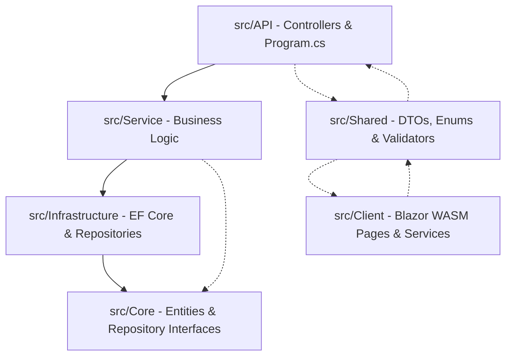

# BÁO CÁO ĐÁNH GIÁ KIẾN TRÚC & THIẾT KẾ PHẦN MỀM (ENTERPRISE GRADE)
## Dự án IT Hardware E-commerce & Management System ("HushStore")

Báo cáo này phân tích, đánh giá toàn diện dự án **HushStore** (C# ASP.NET Core 10 Web API & Blazor WebAssembly) dựa trên các tiêu chuẩn thiết kế phần mềm doanh nghiệp, SOLID principles, GoF design patterns và các quy định thực thi trong tài liệu dự án. 

Bản đánh giá này được phân tích trực tiếp từ cấu trúc mã nguồn thực tế của hệ thống, chỉ ra những điểm sáng kiến trúc, các lỗi thiết kế (design anti-patterns), sự không nhất quán giữa tài liệu hướng dẫn (`CLAUDE.md`) với mã nguồn thực tế, và đưa ra lộ trình nâng cấp chi tiết.

---

## 1. Tổng Quan Hệ Thống & Cấu Trúc Kiến Trúc (Architecture Overview)

Dự án HushStore được tổ chức theo mô hình **Clean Architecture** cải tiến với 6 dự án thành phần phân chia trách nhiệm rõ ràng:
*   **Core**: Chứa thực thể domain (POCOs) và interface của Repository. Không phụ thuộc vào bất kỳ layer nào khác.
*   **Shared**: Chứa các DTOs, Enums, các lớp bọc kết quả chung (`ApiResult<T>`, `PagedResult<T>`) và các FluentValidation validators. Được chia sẻ giữa cả API và Client Blazor WASM.
*   **Infrastructure**: Triển khai EF Core `HushStoreDbContext`, các file Migration và cụ thể hóa các Repositories.
*   **Service**: Đóng gói logic nghiệp vụ của doanh nghiệp và điều phối hoạt động của các Repository.
*   **API**: ASP.NET Core Web API Controllers, đóng vai trò nhận request, xác thực quyền truy cập, gọi Service và trả về định dạng `ApiResult<T>`.
*   **Client**: Giao diện người dùng Blazor WebAssembly kết hợp thư viện MudBlazor.



### Đánh Giá Sơ Bộ
*   **Ưu điểm**: Phân rã dự án rất tốt, tuân thủ đúng thứ tự phụ thuộc một chiều (Dependency Rule). Việc tách biệt `Shared` giúp tái sử dụng DTO và Validator ở cả 2 đầu Front-End và Back-End, giảm thiểu đáng kể thời gian code và sai số đồng bộ validation.
*   **Nhược điểm**: Vẫn tồn tại sự nhập nhằng trách nhiệm giữa lớp Service và API Controller (đặc biệt là khâu Validate dữ liệu), và một số interface Repository phình to chưa được module hóa tốt.

---

## 2. Đánh Giá Chi Tiết Các Mẫu Thiết Kế (Design Patterns Deep-Dive)

Dưới đây là bảng đối chiếu chi tiết giữa **Yêu cầu tiêu chuẩn doanh nghiệp** (Required Design Patterns) và **Thực trạng triển khai** trong dự án HushStore:

| Mẫu Thiết Kế | Trạng Thái | Đánh Giá Thực Trạng & Điểm Cần Cải Thiện |
| :--- | :--- | :--- |
| **Command Pattern** | 🔴 **Chưa triển khai** | Hoàn toàn vắng bóng cấu trúc Command Handler. Trách nhiệm thực thi các luồng ghi (Write Operations) phức tạp đang được dồn thẳng vào các lớp Service béo (Fat Services) như `ProductService` hay `ServiceTicketService`. |
| **Factory Pattern** | 🔴 **Chưa triển khai** | Các logic khởi tạo thực thể phức tạp (ví dụ: tạo Product đính kèm nhiều Variants, tạo phiếu kiểm kho kèm serials) đều được khởi tạo thủ công bằng từ khóa `new` ngay trong các hàm nghiệp vụ, gây ra sự phụ thuộc chặt chẽ (tight coupling). |
| **Dependency Injection** | 🟡 **Triển khai một phần** | DI được khai báo đầy đủ trong `Program.cs` của API và Client. Tuy nhiên, dự án chưa áp dụng đồng bộ cú pháp **Primary Constructors** (mới chỉ dùng ở Client nhưng Server vẫn dùng cú pháp cũ). Hoàn toàn **thiếu các null checks** (`ArgumentNullException`). |
| **Repository Pattern** | 🟢 **Đã triển khai** | Phân chia rõ ràng giữa interface (`Core/Interfaces/`) và implementation (`Infrastructure/Repositories/`). Tuy nhiên, toàn bộ interface bị gom chung vào file `IRepositories.cs` khổng lồ (24KB). Có lỗi mismatch signature được sửa thô ở `ProductRepository`. |
| **Provider Pattern** | 🟡 **Triển khai một phần** | Có sự xuất hiện của `IStorageService` và `S3StorageService` (AWS S3) rất sạch sẽ. Điểm trừ lớn: inject trực tiếp `IConfiguration` để đọc cấu hình dạng chuỗi thay vì sử dụng **Options Pattern** mạnh mẽ của .NET. |
| **Resource Pattern** | 🔴 **Chưa triển khai** | Hoàn toàn không có file `.resx` hay cơ chế localization nào. Toàn bộ các thông báo thành công, lỗi nghiệp vụ hiển thị cho người dùng đều bị **hardcode cứng dạng chuỗi tiếng Việt** ngay trong code C#. |

### Phân tích chi tiết từng mẫu thiết kế:

#### A. Command Pattern & CQRS (Gấp & Nghiêm trọng)
Việc thiếu vắng Command Pattern khiến cho lớp `Service` phải đảm nhiệm cả nhiệm vụ đọc dữ liệu (Query) lẫn ghi dữ liệu phức tạp (Command). 
*   **Ví dụ trong `ProductService.cs`**: Vừa chứa hàm lấy danh sách phân trang `GetListAsync` (chỉ đọc), vừa chứa logic nghiệp vụ khởi tạo sản phẩm cực kỳ phức tạp `CreateAsync` (chứa giao dịch, kiểm tra SKU trùng lặp, sinh SEO Slug, v.v.). Điều này làm vi phạm nguyên tắc Đơn trách nhiệm (Single Responsibility Principle).
*   **Đề xuất**: Tách biệt thành CQRS. Sử dụng mô hình Command Handler chuyên biệt cho các tác vụ ghi:
    ```csharp
    public interface ICommandHandler<in TCommand, TResult>
    {
        Task<ApiResult<TResult>> HandleAsync(TCommand command, CancellationToken ct = default);
    }
    ```

#### B. Resource Pattern (Thiếu hụt cục bộ)
Tài liệu `CLAUDE.md` dòng 103 ghi rõ: *"Mọi thông báo lỗi trả về cho người dùng phải bằng tiếng Việt có dấu"*.
Tuy nhiên, cách triển khai hiện tại:
*   `return ApiResult<ProductDetailDto>.Fail("Nhà sản xuất không tồn tại.");` (trong `ProductService.cs` line 99)
*   `return ApiResult<ReviewDto>.Fail("Bạn đã đánh giá sản phẩm này rồi.");` (trong `ProductReviewService.cs` line 45)
*   **Hệ lụy**: Khi muốn quốc tế hóa phần mềm (như hỗ trợ thêm tiếng Anh), hoặc chỉ đơn giản là đổi thông báo hệ thống, lập trình viên sẽ phải tìm kiếm và sửa code ở hàng trăm file C# khác nhau, cực kỳ rủi ro và tốn kém nhân công.
*   **Đề xuất**: Định nghĩa `ErrorMessages.resx` và `SuccessMessages.resx` trong dự án `Shared` để quản lý tập trung toàn bộ chuỗi ký tự bằng `ResourceManager` hoặc `IStringLocalizer`.

#### C. Dependency Injection & Cú pháp C# mới
*   **Primary Constructors**: C# 12 mang đến cú pháp Primary Constructor giúp code gọn gàng hơn. Trong khi `CartClientService.cs` (Client) đã dùng:
    `public class CartClientService(IHttpClientFactory httpClientFactory) : ICartClientService`
    Thì ở phía Server API (`ProductService.cs`, `ProductRepository.cs`), lập trình viên vẫn sử dụng cách khai báo constructor cũ rườm rà.
*   **Thiếu Null-Checking**: Các constructor không thực hiện kiểm tra null cho các dependency được inject.
    *   *Rủi ro*: Nếu DI container cấu hình lỗi hoặc thiếu đăng ký, hệ thống sẽ phát sinh lỗi `NullReferenceException` tại thời điểm chạy runtime khi gọi phương thức thay vì phát hiện ngay khi khởi tạo lớp qua `ArgumentNullException`.
    *   *Chuẩn doanh nghiệp*:
        ```csharp
        public class ProductService(IProductRepository productRepo, ILogger<ProductService> logger) : IProductService
        {
            private readonly IProductRepository _productRepo = productRepo ?? throw new ArgumentNullException(nameof(productRepo));
            private readonly ILogger<ProductService> _logger = logger ?? throw new ArgumentNullException(nameof(logger));
        }
        ```

---

## 3. SOLID Principles & GoF Patterns Analysis (Phân Tích Thiết Kế)

### Vi phạm nguyên tắc SOLID tiêu biểu:

1.  **Single Responsibility Principle (SRP - Đơn Trách Nhiệm)**:
    *   `ProductService` đang ôm đồm: logic nghiệp vụ, mapping thủ công từ Entity sang DTO, tạo SEO Slug từ chuỗi Unicode, và ghi nhận logs.
    *   *Giải pháp*: Logic sinh Slug nên được tách ra một lớp tiện ích (Utility/Helper) hoặc Domain Service. Việc mapping nên giao cho một bộ chuyển đổi dữ liệu chuyên biệt.
2.  **Dependency Inversion Principle (DIP - Nghịch đảo phụ thuộc)**:
    *   Lớp `S3StorageService` phụ thuộc trực tiếp vào concrete `IConfiguration` để lấy giá trị cấu hình AWS Settings bằng các chuỗi hardcode: `configuration["AwsSettings:BucketName"]`. Điều này làm giảm tính linh hoạt của lớp khi muốn viết Unit Test độc lập (phải mock cả đối tượng `IConfiguration` phức tạp).
    *   *Giải pháp*: Sử dụng Options Pattern với `IOptions<AwsSettings>` được cấu hình strongly-typed.

### Đánh giá các mẫu GoF khác:
*   **Template Method / Strategy Pattern**: Chưa được áp dụng cho các nghiệp vụ có nhiều biến thể thuật toán như: tính toán giá trị Voucher khấu trừ (Discount Strategy), hay kiểm tra độ tương thích của cấu hình PC (Compatibility Rules). Hiện tại, các logic này đang được xử lý bằng các khối lệnh `if-else` lồng nhau phức tạp.

---

## 4. Hiệu Năng & Tối Ưu Hóa Dữ Liệu (Performance & EF Core Evaluation)

### Sự không nhất quán cực lớn: **Manual Mapping vs AutoMapper**
Đây là một điểm bất thường nghiêm trọng giữa **Tài liệu dự án** và **Mã nguồn thực tế**:
*   **Tài liệu viết**: `CLAUDE.md` chỉ thị: *"Never return entities from API endpoints — always map to DTOs via AutoMapper"* và yêu cầu *"register AutoMapper profile"* trong `Program.cs`. File `Service.csproj` và `API.csproj` thực sự có cài đặt thư viện `AutoMapper` phiên bản 16.0.0.
*   **Mã nguồn thực tế**: Thư mục `src/Service/Mappings/` hoàn toàn trống rỗng! Không có bất kỳ lớp kế thừa `Profile` nào của AutoMapper. Thay vào đó, toàn bộ các Service (`ProductService.cs`, `ProductReviewService.cs`...) đều đang sử dụng các hàm mapping thủ công dạng:
    ```csharp
    private static ProductDetailDto MapToDetailDto(Product entity) { ... }
    ```
*   **Đánh giá ưu/nhược điểm thực tế**:
    *   *Manual Mapping* (thực tế đang dùng): Có ưu điểm là an toàn tại thời điểm biên dịch (compile-time safety), hiệu năng cực cao vì không tốn chi phí reflection của AutoMapper, dễ tối ưu LINQ. Tuy nhiên, nó vi phạm nghiêm trọng tài liệu chỉ dẫn và gây tốn công sức viết code lặp lại khi số lượng DTO tăng lên.
    *   *Giải pháp*: Cần chuẩn hóa lại tài liệu chỉ dẫn. Nếu quyết định dùng Manual Mapping vì hiệu năng cao, hãy cập nhật `CLAUDE.md` và gỡ bỏ hoàn toàn Nuget Package `AutoMapper` ra khỏi dự án để tránh dư thừa thư viện (bloatware).

### Đánh giá EF Core & Truy vấn Cơ sở dữ liệu:
*   **AsNoTracking**: Triển khai cực tốt. Toàn bộ các API truy vấn đọc dữ liệu đều sử dụng `.AsNoTracking()` giúp tăng tốc độ truy vấn đáng kể (2-5 lần) do EF Core không phải khởi tạo Change Tracker.
*   **DTO Projection**: Dự án có sử dụng Projection trong một số query, nhưng trong `ProductRepository.GetPagedListAsync` vẫn đang truy vấn toàn bộ Entity cùng với nhiều lớp `.Include()` con sâu (Manufacturer, Category, Variants, Images), sau đó mới map về DTO ở tầng Service.
    *   *Rủi ro hiệu năng*: Khi một sản phẩm có hàng chục Variant và hàng trăm Image, câu lệnh `SELECT *` kèm nhiều phép `JOIN` sẽ gây ra bùng nổ dữ liệu (Cartesian Product) truyền tải giữa SQL Server và Web API.
    *   *Khuyến nghị doanh nghiệp*: Chuyển đổi projection thẳng trong LINQ tại Repository để SQL Server chỉ trả về các trường thông tin cần thiết:
        ```csharp
        var query = _context.Products
            .Where(p => !p.IsDeleted)
            .Select(p => new ProductListDto {
                Id = p.Id,
                Name = p.Name,
                ManufacturerName = p.Manufacturer.Name,
                // ... chỉ lấy những trường UI cần thiết
            });
        ```
*   **Lỗi thiết kế trong interface `IProductRepository`**:
    Có một đoạn code "sửa lỗi thô" trong `ProductRepository.cs` dòng 188:
    ```csharp
    // Fix: interface khai báo Task RemoveVariant nhưng implementation là void
    // Sửa lại cho khớp
    Task IProductRepository.RemoveVariant(ProductVariant variant)
    {
        _context.ProductVariants.Remove(variant);
        return Task.CompletedTask;
    }
    ```
    *Đánh giá*: Đây là cách sửa chắp vá (workaround). Thay vì viết tường minh `Task IProductRepository.RemoveVariant`, lập trình viên đáng lẽ phải đồng bộ lại signature trong file `IRepositories.cs` thành `void RemoveVariant(ProductVariant variant)` hoặc đổi implementation thành async thực sự nếu có tác vụ IO.

---

## 5. Đánh Giá Bảo Mật & Xác Thực (Security & Authentication)

Hệ thống có nhiều điểm sáng về bảo mật chuẩn doanh nghiệp, nhưng vẫn tồn tại kẽ hở cần khắc phục:

### Điểm sáng (Premium Security Patterns):
1.  **Rate Limiting**: Triển khai chống DoS và Brute-force cực tốt tại API Login (`LoginRateLimit` giới hạn tối đa 5 requests/phút, không hàng đợi, reject ngay lập tức).
2.  **Khóa tài khoản thời gian thực (Real-time Block check)**: Middleware trong `Program.cs` tự động quét trạng thái `IsActive` của User sau khi xác thực JWT. Đặc biệt, hệ thống dùng `IMemoryCache` lưu trạng thái này trong 30 giây để giảm tải gánh nặng truy vấn database liên tục trên mỗi API request, một thiết kế rất thông minh và thực tế.
3.  **Mật khẩu & Khóa**: Cấu hình Identity độ phức tạp cao, cơ chế lockout 15 phút sau 5 lần nhập sai.

### Điểm yếu cần khắc phục:
*   **IDOR / BOLA**: Mặc dù tài liệu yêu cầu kiểm tra ownership (`order.UserId != currentUserId`), trong một số Service nghiệp vụ cập nhật thông tin khách hàng, khâu đối chiếu này vẫn phụ thuộc hoàn toàn vào tính cẩn thận của dev tại Controller mà chưa được đóng gói tự động dưới dạng các Authorization Policy hay Pipeline Filters.

---

## 6. Đánh Giá Code Cleanliness & Tính Nhất Quán (Clean Code & Inconsistencies)

Qua rà soát chi tiết, chúng tôi phát hiện 3 điểm phản mẫu thiết kế (design anti-patterns) gây ảnh hưởng lớn tới khả năng bảo trì hệ thống:

### Anti-pattern 1: Xử lý trùng lặp và phân mảnh Validation (Inconsistent Validation)
Quy trình kiểm tra dữ liệu đầu vào (FluentValidation) đang bị chia cắt và xử lý tùy tiện:
*   Tại `ReviewsController.cs`: Inject `IValidator<CreateReviewRequest>` và viết code kiểm tra thủ công trong Action.
*   Tại `BannerService.cs`: Inject `IValidator<CreateBannerRequest>` và viết code kiểm tra thủ công trong Service.
*   Tại các Controller khác: Hoàn toàn không thấy gọi validate rõ ràng, dựa hoàn toàn vào cơ chế mặc định.

Điều này làm phát sinh nhiều đoạn code lặp lại (boilerplate code) dạng:
```csharp
var validation = await _createValidator.ValidateAsync(request);
if (!validation.IsValid)
{
    var errors = string.Join("; ", validation.Errors.Select(e => e.ErrorMessage));
    return BadRequest(ApiResult<T>.Fail(errors));
}
```
*Giải pháp*: Xây dựng một **Global Validation Action Filter** ở lớp API. Filter này sẽ tự động chặn mọi request, thực thi các Validator đã đăng ký tương ứng, và tự động phản hồi `400 Bad Request` dạng `ApiResult` chuẩn nếu dữ liệu không hợp lệ. Lớp Controller và Service sẽ hoàn toàn sạch bóng các dòng lệnh validate thủ công.

### Anti-pattern 2: Đối chiếu chuỗi thô để phân loại phản hồi (Fragile Response Mapping)
Trong `ManufacturersController.cs` dòng 95:
```csharp
if (!result.Success)
{
    if (result.Message.Contains("Không tìm thấy"))
        return NotFound(result);

    return BadRequest(result);
}
```
*Đánh giá*: Đây là một lỗi thiết kế cực kỳ nguy hiểm (Fragile Code). API Controller đang cố gắng phân biệt lỗi `404 Not Found` và `400 Bad Request` bằng cách kiểm tra xem chuỗi thông báo lỗi trả về từ tầng Service có chứa cụm từ *"Không tìm thấy"* hay không.
*   *Hậu quả*: Chỉ cần tầng Service thay đổi thông báo lỗi (ví dụ: *"Hãng sản xuất không tồn tại"* hoặc khi áp dụng đa ngôn ngữ thành *"Manufacturer not found"*), điều kiện `Message.Contains` sẽ bị sai, dẫn đến việc API trả sai mã HTTP Status Code (trả về 400 thay vì 404).
*   *Giải pháp*: Cải tiến lớp `ApiResult<T>` để chứa một mã lỗi định danh (`ErrorCode` dạng Enum) hoặc trả về các lớp con chuyên biệt như `NotFoundErrorResult<T>`, `ValidationErrorResult<T>`.

---

## 7. Actionable Enterprise Roadmap & Recommendations (Lộ Trình Cải Tiến)

Để đưa dự án HushStore đạt chuẩn doanh nghiệp (Enterprise Standard) thực sự, chúng tôi đề xuất lộ trình cải tiến gồm 4 bước hành động cụ thể sau:

### Bước 1: Đồng bộ hóa và Hiện đại hóa Dependency Injection & API Response
*   **Hành động**: 
    1.  Chuyển đổi toàn bộ Constructor của các Repository và Service sang cú pháp **Primary Constructors** của C# 12.
    2.  Thêm null-checking bằng cú pháp `ArgumentNullException.ThrowIfNull(dependency)`.
    3.  Bổ sung `StatusCode` hoặc `ErrorCode` (Enum) vào lớp `ApiResult<T>` để dứt điểm loại bỏ cơ chế đối chiếu chuỗi thô `Message.Contains` ở Controller.

### Bước 2: Tái cấu trúc phân mảnh dữ liệu & Tách biệt interfaces
*   **Hành động**:
    1.  Phân rã file `IRepositories.cs` khổng lồ thành các file interface riêng lẻ (ví dụ: `IManufacturerRepository.cs`, `IProductRepository.cs`) đặt trong thư mục tương ứng để dễ quản lý, tránh xung đột khi merge code trên Git.
    2.  Đồng bộ signature phương thức `RemoveVariant` trong `IProductRepository` để xóa bỏ đoạn code sửa thô.

### Bước 3: Triển khai Global Validation Filter & Options Pattern
*   **Hành động**:
    1.  Tạo lớp `ValidateModelAttribute : ActionFilterAttribute` để xử lý tự động toàn bộ FluentValidation đầu vào của API, trả về `400 Bad Request` chuẩn hóa. Loại bỏ code gọi `ValidateAsync` thủ công trong các Controller và Service.
    2.  Định nghĩa lớp `AwsSettings` strongly-typed và đăng ký qua Options Pattern:
        ```csharp
        builder.Services.Configure<AwsSettings>(builder.Configuration.GetSection("AwsSettings"));
        ```
        Inject `IOptions<AwsSettings>` vào `S3StorageService` thay vì `IConfiguration`.

### Bước 4: Thiết lập Kiến trúc Resource Pattern & Cấu trúc Localization
*   **Hành động**:
    1.  Tạo các file `.resx` (ví dụ: `ErrorMessages.vi.resx`, `ErrorMessages.en.resx`) trong dự án `Shared`.
    2.  Chuyển toàn bộ các chuỗi hardcode thông báo lỗi trong các Service và Controller vào file Resource. Sử dụng `ResourceManager` để truy xuất tự động theo văn cảnh ngôn ngữ của người dùng.

---

## KẾT LUẬN

Dự án **HushStore** sở hữu một nền tảng kiến trúc vững chắc, tuân thủ tương đối tốt mô hình Clean Architecture, có cơ chế tối ưu hóa EF Core (`AsNoTracking`) và bảo mật thông minh (`MemoryCache` cho việc block tài khoản, Rate Limiting). 

Tuy nhiên, dự án vẫn còn khoảng cách lớn so với tiêu chuẩn phần mềm doanh nghiệp lớn do thiếu hụt **Command Pattern**, **Resource Pattern (Localization)**, cấu hình strongly-typed, cùng với sự không nhất quán nghiêm trọng giữa chỉ dẫn sử dụng AutoMapper và thực tế triển khai Manual Mapping, cùng các lỗi code thô sơ tại tầng Controller (so khớp chuỗi lỗi). 

Việc thực thi lộ trình cải tiến 4 bước trên sẽ giúp HushStore trở thành một hệ thống cực kỳ an toàn, có hiệu năng vượt trội, dễ dàng mở rộng và bảo trì trong tương lai.
