# Bảo mật hệ thống HushStore — bảy lớp phòng thủ

> **Tài liệu này dành cho ai:** thành viên trong nhóm cần **giải thích được** hệ
> thống phòng thủ khi bảo vệ đồ án, không cần đọc code.
>
> **Khác gì hai tài liệu kia:**
> - [thiet-ke-he-thong-aws.md](thiet-ke-he-thong-aws.md) — *hệ thống là gì*
> - [security-validation-report.md](security-validation-report.md) — *kết quả 12
>   kịch bản đã chạy*, có nguyên lệnh và nguyên output
> - **Tài liệu này** — *vì sao nó chặn được*, và **trả lời được câu hỏi phản biện**
>
> Đọc mục 1, 2 và 6 là đủ để bảo vệ. Mục 3 là chi tiết từng lớp, tra khi cần.

---

## 1. Hai nguyên tắc — và vì sao đề bài chấm đúng hai cái này

Đề bài viết: *"Đảm bảo các luật được mở theo đúng yêu cầu, không mở quá rộng, mở
theo nguyên tắc tối thiểu"* và *"các rules đã ngăn chặn được các cuộc tấn công"*.
Đó chính là hai nguyên tắc kinh điển của bảo mật hạ tầng.

### Nguyên tắc tối thiểu đặc quyền (least privilege)

**Mỗi thành phần chỉ được cấp đúng quyền nó cần để làm việc của nó — không hơn
một chút nào.**

Cách hiểu sai phổ biến: "cấp ít quyền là được". Cách hiểu đúng: **quyền được xác
định bởi công việc, không bởi cảm giác nhiều hay ít.** Nên câu hỏi luôn là *"nó
cần gì để chạy?"*, rồi cấp đúng thế, rồi **chứng minh** rằng ngoài thế là không
làm được.

Ví dụ cụ thể trong hệ thống này: container API cần ghi ảnh sản phẩm lên S3. Nên
role của nó có `s3:PutObject` — và **không có** quyền nào với RDS, dù nó nói
chuyện với database suốt ngày. Vì nó nói chuyện với database qua **kết nối
SQL trên port 1433**, không qua **API của AWS**. Hai đường hoàn toàn khác nhau, và
gộp chúng lại là chỗ nhiều người mất điểm.

### Phòng thủ nhiều lớp (defense in depth)

**Giả định mỗi lớp sẽ có ngày bị vượt qua. Nên phải có lớp sau.**

Cách hiểu sai: "nhiều lớp cho chắc". Cách hiểu đúng: **mỗi lớp phải chặn được
thứ mà lớp khác không chặn được.** Ba lớp giống nhau là một lớp, chỉ tốn công.

Trong hệ thống này, ba lớp mạng đầu tiên **không** trùng nhau:

| Lớp | Làm được điều lớp kia không làm được |
|---|---|
| Network ACL | **DENY được** một IP cụ thể. Security Group không có khái niệm DENY |
| Security Group | **Tham chiếu được SG khác** làm nguồn ("chỉ nhận từ ALB", không cần biết IP ALB là gì). NACL chỉ hiểu CIDR |
| Kiến trúc mạng | Không có **đường đi** nào tồn tại. Rule là "cấm đi"; không có route là "không có đường" |

Lớp thứ ba mạnh nhất và cũng khó hiểu nhất: nó không chặn ai cả, nó làm cho việc
tấn công **không có nghĩa**. Không thể gõ sai mật khẩu vào một cánh cửa không tồn tại.

---

## 2. Sơ đồ: một request đi qua bảy lớp

```mermaid
flowchart TB
    A["🌐 Request từ Internet"]

    subgraph L1["Lớp 1 — Network ACL (stateless, có DENY)"]
        L1a["nacl-public: chỉ 80, 443 vào<br/>rule 50 DENY được 1 IP cụ thể"]
        L1b["nacl-app: rule 90 DENY 22<br/>rule 95 DENY 1433"]
        L1c["nacl-db: CHỈ 1433 từ app CIDR"]
    end

    subgraph L2["Lớp 2 — Security Group (stateful, chỉ allow)"]
        L2a["sg-alb: 80/443 ← internet<br/>egress CHỈ tới sg-web"]
        L2b["sg-web: 80/8080 ← CHỈ sg-alb<br/>KHÔNG có rule 22"]
        L2c["sg-rds: 1433 ← CHỈ sg-web<br/>egress RỖNG"]
    end

    subgraph L3["Lớp 3 — Application Load Balancer"]
        L3a["TLS 1.2+ terminate bằng cert ACM"]
        L3b["Allowlist Host header<br/>2 tên miền, mọi tên khác → 403"]
    end

    subgraph L4["Lớp 4 — Kiến trúc mạng"]
        L4a["EC2 KHÔNG có IP public"]
        L4b["Subnet db KHÔNG có route ra Internet"]
    end

    subgraph L5["Lớp 5 — IAM"]
        L5a["10 role tách phạm vi<br/>không role nào có *FullAccess*"]
        L5b["Deny TƯỜNG MINH: host không đọc được secret"]
    end

    subgraph L6["Lớp 6 — Bí mật"]
        L6a["SSM SecureString, mã hoá bằng KMS"]
        L6b["Hai tập bí mật giao nhau = RỖNG"]
    end

    subgraph L7["Lớp 7 — Ứng dụng"]
        L7a["JWT: 4 phép kiểm, lệch giờ tối đa 1 phút"]
        L7b["Rate limit đăng nhập: 5 lần/phút"]
        L7c["Truy vấn ĐÓNG KHUNG theo userId trong token"]
        L7d["EF Core tham số hoá → không SQL injection"]
    end

    DB["🗄️ RDS SQL Server"]

    A --> L1 --> L2 --> L3 --> L4 --> L5 --> L6 --> L7 --> DB

    style L1 fill:#ffe6e6
    style L2 fill:#fff0e6
    style L3 fill:#fffbe6
    style L4 fill:#e6ffe6
    style L5 fill:#e6f7ff
    style L6 fill:#f0e6ff
    style L7 fill:#ffe6f7
```



**Điểm quan trọng của sơ đồ:** nó **không** phải bảy cái cổng giống nhau xếp
hàng. Mỗi lớp trả lời một câu hỏi khác:

| Lớp | Câu hỏi nó trả lời |
|---|---|
| 1. NACL | Gói tin này có được vào **subnet** này không? |
| 2. Security Group | Gói tin này có được vào **máy** này không? |
| 3. ALB | Request này gửi tới **tên miền** nào? Có mã hoá không? |
| 4. Kiến trúc | Có **tồn tại đường đi** tới đích không? |
| 5. IAM | Danh tính này được gọi **API AWS** nào? |
| 6. Bí mật | Ai đọc được **mật khẩu**? |
| 7. Ứng dụng | Người dùng này được xem **dữ liệu của ai**? |

Vượt được lớp 1–4 chỉ có nghĩa là *chạm được vào ứng dụng*. Lớp 5–7 mới quyết
định **lấy được gì**.

---

## 3. Từng lớp — chặn gì, và không chặn gì

### Lớp 1 — Network ACL

**Bản chất: stateless.** Đây là câu quan trọng nhất của cả tài liệu.

*Stateless* nghĩa là NACL **không nhớ** gói tin nào đã đi qua. Máy A gửi request
ra Internet, phản hồi quay về — với NACL đó là hai gói tin **không liên quan gì
nhau**, phải có rule riêng cho mỗi chiều.

Hệ quả trực tiếp và rất khó chịu: khi máy trong `app` subnet gọi ra Internet
(pull image từ ECR), phản hồi quay về có **nguồn là `0.0.0.0/0`** và **cổng đích
là một số ngẫu nhiên trong dải 1024–65535** (gọi là *cổng ephemeral*). Nên
`nacl-app` **buộc phải** có rule:

```
inbound 120: allow TCP 1024-65535 ← 0.0.0.0/0
```

Nhưng `1433` (SQL Server) và `8080` (API) **đều nằm trong dải đó**. Rule 120 vô
tình mở chúng ra cả Internet ở tầng NACL.

Bản sửa: đặt DENY ở **số nhỏ hơn**, vì NACL xét rule **theo thứ tự tăng dần và
dừng ở rule đầu tiên khớp**:

```
inbound  90: DENY  TCP 22          ← 0.0.0.0/0    ← chặn SSH
inbound  95: DENY  TCP 1433        ← 0.0.0.0/0    ← chặn trước rule 120
inbound 100: allow TCP 80          ← public CIDR
inbound 110: allow TCP 8080        ← public CIDR  ← chỉ từ ALB subnet
inbound 115: DENY  TCP 8080        ← 0.0.0.0/0    ← chặn mọi nguồn khác
inbound 120: allow TCP 1024-65535  ← 0.0.0.0/0    ← return traffic
```

Thứ tự 110 rồi 115 là một mẫu đáng học: **cho phép hẹp trước, chặn rộng sau.**
Request từ ALB khớp rule 110 và được vào; mọi request 8080 từ nơi khác đi tiếp
xuống rule 115 và bị chặn.

**Điều NACL làm được mà SG không làm được:** rule 50 của `nacl-public` là
`DENY all ← <IP laptop>`. Security Group **không có** cú pháp DENY — nó chỉ là
danh sách cho phép. Muốn chặn đúng một IP thì **bắt buộc** phải dùng NACL. Đây là
kịch bản kiểm thử số 8 và là câu trả lời gọn nhất cho *"đã có SG rồi thì NACL để
làm gì?"*.

**Điều NACL không làm được:** không hiểu "từ Security Group nào". Nó chỉ hiểu dải
IP. Nên nó không thể diễn tả được "chỉ nhận từ ALB" — đó là việc của lớp 2.

### Lớp 2 — Security Group

**Bản chất: stateful, và chỉ có allow.**

*Stateful* nghĩa là SG **nhớ** kết nối. Cho request đi vào thì phản hồi tự động
được đi ra, không cần rule. Nên SG không có bài toán cổng ephemeral — nó đơn giản
hơn NACL rất nhiều, và cũng vì thế **không diễn tả được DENY**.

Điểm mạnh riêng: **nguồn của một rule có thể là một Security Group khác.**

```
sg-web ingress: cho phép 8080 từ  sg-alb
```

Không phải "từ 10.20.0.0/24". Câu này nghĩa là *"chỉ những máy đang nằm trong
sg-alb"* — nên khi ALB được dựng lại với IP mới, rule vẫn đúng, **không phải sửa
gì**. Đây là cách diễn tả *quan hệ tin cậy* thay vì *địa chỉ*, và là lý do rule
của ta không dùng CIDR ở đâu ngoài chỗ buộc phải mở ra Internet.

Ba SG, và ba điều đáng nói:

| SG | Chi tiết đáng nói |
|---|---|
| `sg-alb` | Egress **chỉ** tới `sg-web` port 80 và 8080. ALB bị chiếm cũng không gọi ra Internet được |
| `sg-web` | **Không có rule port 22 nào.** Không phải "đóng lại" — mà là **chưa từng mở** |
| `sg-rds` | Egress **RỖNG**. Chiếm được database cũng không có đường đẩy dữ liệu ra ngoài |

`sg-rds` egress rỗng là chi tiết hay bị bỏ qua nhất. Đa số người chỉ nghĩ đến
"ai vào được"; nhưng thiệt hại thật của một vụ rò rỉ nằm ở chiều **đi ra**. RDS
không cần gọi ra ngoài, nên nó không được phép.

### Lớp 3 — Application Load Balancer

Ba việc bảo mật ALB làm:

**1. Terminate TLS.** Cert do ACM cấp, miễn phí và tự gia hạn. Policy là
`ELBSecurityPolicy-TLS13-1-2-2021-06` — cho phép TLS **1.2 và 1.3**, từ chối
1.0 và 1.1 (hai phiên bản đã bị coi là không an toàn). Listener port 80 không
phục vụ gì, chỉ redirect 301 sang 443.

> Đọc kỹ tên policy: nó **không** phải "TLS 1.3 only". Bản 1.3-only là
> `ELBSecurityPolicy-TLS13-1-3`. Ta không dùng bản đó vì sẽ loại trình duyệt cũ.

**2. Allowlist Host header.** Chỉ **hai** tên miền được đi tiếp:

```
Host: api.hushstore.io.vn  → target group api  (port 8080)
Host: hushstore.io.vn      → target group web  (port 80)
mọi Host khác              → 403 Forbidden
```

Cả hai đều là rule **tường minh**. Không dùng "default action" cho tên miền
chính — để default action giữ đúng một vai: **chặn**. Nhờ vậy máy quét tự động
gọi thẳng vào DNS của ALB sẽ nhận 403, không thấy được ứng dụng.

Và `www.hushstore.io.vn` **không** có trong allowlist, có chủ ý: nó không tồn tại
trong DNS và không có trong cert, nên sẽ lỗi ở tầng TLS trước khi tới được đây.
Một dòng allowlist không bao giờ chạy tới thì **tệ hơn là không có** — nó làm
người đọc tin rằng `www` đang được hỗ trợ.

**3. Che hoàn toàn máy thật.** Client không bao giờ biết IP của EC2. ALB là thứ
duy nhất có mặt trên Internet.

### Lớp 4 — Kiến trúc mạng: phòng thủ mạnh nhất không phải là một rule

Hai quyết định, không phải rule nào, nhưng chặn được nhiều nhất:

**EC2 không có IP public.** Không phải "chặn truy cập từ Internet" — mà là
**không tồn tại địa chỉ nào để gõ**. Không có rule nào để cấu hình sai, không có
rule nào để quên. Máy vẫn tải được phần mềm nhờ **NAT Gateway** — cơ chế cho phép
đi ra nhưng không cho vào (xem Phần I mục 6 của tài liệu thiết kế).

**Subnet database không có route ra Internet.** Route table của nó **không có**
dòng `0.0.0.0/0`. Nên kể cả khi ai đó cấu hình sai mọi Security Group và mọi
NACL, gói tin từ RDS vẫn không biết đi đâu. Đây là loại phòng thủ không phụ thuộc
vào việc con người có cấu hình đúng hay không.

### Lớp 5 — IAM: mười danh tính, và một chữ Deny quan trọng

Tách quyền theo **việc**, không theo **máy**. Toàn hệ thống có **10 IAM role**,
không role nào dùng managed policy `*FullAccess`:

**Năm role của workload (module `ecs`)** — đây là chỗ điểm least privilege được chấm:

| Role | Của ai | Được làm gì |
|---|---|---|
| `container-instance` | Máy EC2 | Đăng ký vào ECS cluster, chạy Session Manager. **Deny tường minh** đọc secret; **không** chạm S3 ảnh |
| `task-execution` | ECS agent lúc khởi `api`/`web` | Pull image, ghi log, đọc **đúng** tập secret của hai task đó |
| `task-execution-seeder` | ECS agent lúc khởi `seeder` | Như trên, nhưng tập secret **khác** — giao với tập trên bằng rỗng |
| `task-app` | Code API lúc chạy | **Chỉ** `s3:PutObject`/`GetObject` trên prefix ảnh + kênh ECS Exec |
| `task-migrator` | Task migration | Chỉ đủ để chạy migration |

**Hai role của CI/CD (module `cicd`)** — tách quyền đọc và quyền ghi:

| Role | Khi nào dùng | Được làm gì |
|---|---|---|
| `deploy` | push vào `main` | Push ECR, đăng ký task def, update 2 service. **Không** có `autoscaling:SetDesiredCapacity`, **không** có `rds:StartDBInstance` → CI **không thể** bật hạ tầng tốn tiền |
| `plan` | mở Pull Request | Chỉ đọc: `terraform plan` và đọc state. **Không** apply được gì |

**Ba role hạ tầng** — `cost-guard` (Lambda tắt hạ tầng hằng đêm), `scheduler`
(EventBridge gọi Lambda đó), `flow` (VPC Flow Logs ghi CloudWatch).

> Kịch bản kiểm thử 10 và 12 đo **7 role** (5 workload + 2 CI/CD) chứ không phải
> cả 10 — ba role hạ tầng không nhận dữ liệu người dùng và không có đường nào để
> kẻ tấn công chạm tới, nên không nằm trong ma trận blast-radius.

Tách `deploy` khỏi `plan` là một điểm đáng nói: một Pull Request từ người ngoài
chạy được `plan` để xem trước thay đổi, nhưng **không** có đường nào apply.

**Chỗ đáng nói nhất: một câu `Deny` tường minh.**

Máy EC2 cần managed policy `AmazonSSMManagedInstanceCore` để dùng Session Manager
(đường admin **duy nhất** vào máy, vì không có SSH). Nhưng cái tên đó nói ít hơn
thực tế: policy này cấp `ssm:GetParameter` với `Resource: "*"` — nghĩa là **máy
EC2 đọc được mọi bí mật của ta**, gồm mật khẩu database.

Ta không bỏ managed policy (sẽ mất đường vào máy). Ta thêm một câu Deny:

```hcl
statement {
  sid    = "DenyReadingOurSecrets"
  effect = "Deny"
  actions = [
    "ssm:GetParameter",
    "ssm:GetParameters",
    "ssm:GetParameterHistory",   # ← đủ BỐN, không phải ba
    "ssm:GetParametersByPath",
  ]
  resources = ["arn:aws:ssm:*:*:parameter/hushstore/*"]
}
```

Hai điều phải giải thích được nếu bị hỏi:

1. **Vì sao Deny thắng?** Quy tắc đánh giá của IAM: **explicit Deny luôn thắng
   mọi Allow**, bất kể Allow đến từ managed policy nào. Không có ngoại lệ.
2. **Vì sao đủ bốn action?** `GetParameterHistory` với `WithDecryption=true` trả
   về **plaintext** của các version cũ — thiếu nó là còn một đường đọc secret.
   Hiện managed policy không cấp action đó, nên nó đang là *implicit* Deny. Nhưng
   **implicit Deny bị override được** nếu sau này có ai gắn thêm policy;
   **explicit Deny thì không**. Liệt kê đủ bốn là chặn *trước*, không phải chặn
   *cái đang có*.

**Và máy không cần đọc secret.** Việc nhét mật khẩu vào container do **ECS
agent** làm bằng `task-execution` role, không phải role của máy. Nên câu Deny này
không làm gì gãy — đúng định nghĩa của least privilege: bỏ quyền mà không mất
chức năng.

### Lớp 6 — Bí mật

Không còn credential dài hạn nào trong toàn hệ thống:

| Trước | Sau | Cơ chế |
|---|---|---|
| SSH key `.pem` trên máy dev | không có | SSM Session Manager |
| `EC2_SSH_KEY` trong GitHub | không có | GitHub OIDC (token sống vài phút) |
| AWS access key trong `appsettings.json` | không có | ECS task role, SDK tự lấy |
| Token registry | không có | ECR dùng IAM |
| File `.env` trên máy | không có | ECS inject qua `secrets` |

Mật khẩu, connection string và JWT secret nằm trong **SSM Parameter Store** dạng
`SecureString` (mã hoá bằng KMS, **miễn phí** — Secrets Manager tốn $0.40/bí
mật/tháng).

**Chi tiết đáng nói: hai tập bí mật giao nhau bằng rỗng.** Task `api` và task
`seeder` dùng **hai** execution role khác nhau, mỗi role đọc được **đúng** tập
parameter của task đó. Nên một task bị chiếm cũng không làm lộ bí mật của task
kia. Đây là least privilege áp dụng ở tầng *bí mật*, không chỉ tầng *API*.

### Lớp 7 — Ứng dụng: lớp cuối, và cũng là lớp bị tấn công nhiều nhất

Bốn lớp mạng đầu chặn được kẻ tấn công **không mời**. Nhưng khách hàng thật cũng
đi qua đúng bảy lớp đó — nên lớp cuối phải trả lời câu khác: *"người này được xem
dữ liệu của ai?"*

**JWT — bốn phép kiểm, không phải một.** Nhiều người tưởng xác thực token là
"kiểm chữ ký". Ta kiểm bốn thứ:

```csharp
ValidateIssuer           = true,   // ai phát token này?
ValidateAudience         = true,   // token này dành cho ứng dụng nào?
ValidateIssuerSigningKey = true,   // chữ ký có đúng khoá của ta?
ValidateLifetime         = true,   // còn hạn không?
ClockSkew = TimeSpan.FromMinutes(1)
```

`ClockSkew` mặc định của .NET là **5 phút** — nghĩa là token hết hạn vẫn được
nhận thêm 5 phút. Ta hạ xuống **1 phút**. Access token sống 15 phút, refresh
token 7 ngày.

Và trong JWT **không có** dữ liệu nhạy cảm nào. Payload của JWT chỉ là Base64,
**ai cũng giải mã được** — nó chống *sửa*, không chống *đọc*.

**Chống dò mật khẩu.** `POST /api/auth/login` giới hạn **5 lần/phút**, request
thứ 6 nhận HTTP 429. Đây là kịch bản kiểm thử số 6.

> Giới hạn này đếm **trong RAM của một tiến trình**. Nên nếu có hai container API
> thì hạn mức thật thành 10 lần/phút. Đây là lý do thật sự của `max_size = 1`,
> và muốn scale thì phải chuyển bộ đếm sang Redis/ElastiCache. Ghi ở Phần V của
> tài liệu thiết kế.

**Chống IDOR — và ta dùng cách mạnh hơn cách thông thường.** IDOR (*Insecure
Direct Object Reference*) là lỗ hổng khi đổi số trong URL là xem được dữ liệu
người khác: `/api/orders/1042` → `/api/orders/1043`.

Cách thông thường là *kiểm rồi từ chối*:

```csharp
var order = await repo.GetByIdAsync(id);
if (order.UserId != currentUserId) return Forbid();   // kiểm-rồi-chối
```

Cách ta dùng là **đóng khung truy vấn** theo danh tính trong token:

```csharp
var userId = User.FindFirstValue(ClaimTypes.NameIdentifier);  // TỪ TOKEN
var addresses = await _repository.GetByUserIdAsync(userId);    // không nhận id từ URL
```

Khác biệt quan trọng: `userId` lấy từ **token đã xác thực**, không bao giờ từ URL
hay body. Nên **không có tham số nào để đổi**. Cách này mạnh hơn kiểm-rồi-chối vì:

- Không thể quên một endpoint (không có phép kiểm nào để quên)
- Không rò rỉ **sự tồn tại** của bản ghi — 403 gián tiếp tiết lộ "ID này có thật"

**Chống SQL injection.** Toàn bộ truy cập DB qua Entity Framework Core, sinh
**câu lệnh tham số hoá**: dữ liệu người dùng luôn đi vào như *tham số*, không bao
giờ được ghép vào chuỗi SQL. Không có `FromSqlRaw` với chuỗi nối trong dự án.

**Khoá tài khoản có hiệu lực gần như tức thì.** JWT bản chất là *không trạng
thái* — cấp rồi thì không thu lại được, hết hạn mới thôi. Nên admin khoá một tài
khoản thì access token của người đó vẫn còn hiệu lực tối đa 15 phút.

Đóng khoảng đó bằng một middleware chạy **sau** `UseAuthentication()`: mỗi request
đã xác thực đều kiểm cờ `IsActive`, cache 30 giây để không đánh DB mỗi lần.

```
UseForwardedHeaders → UseCors → UseRateLimiter
  → UseAuthentication → [kiểm IsActive] → UseAuthorization
```

Thứ tự này bắt buộc: phải biết *ai* (`UseAuthentication`) trước khi kiểm *người
đó còn được vào không*. Bị khoá thì nhận 403 kèm header `X-Account-Status: locked`
để client tự đăng xuất. **Trần thời gian tụt từ 15 phút xuống 30 giây.**

**`UseForwardedHeaders` phải chạy đầu tiên** — và đây là một chi tiết bảo mật, không
chỉ là chuyện thứ tự. ALB terminate TLS rồi chuyển tiếp bằng HTTP, nên nếu không
đọc `X-Forwarded-Proto` thì ứng dụng tưởng mọi request là HTTP không mã hoá, và
`UseHttpsRedirection` sẽ redirect vô hạn. Quan trọng hơn: **IP thật của client
nằm trong `X-Forwarded-For`** — không đọc header đó thì rate limiter đếm sai, nó
sẽ thấy mọi request đến từ cùng một IP (của ALB) và chặn oan người dùng thật.
Header này chỉ được tin trong phạm vi `KnownNetworks` = CIDR của VPC.

---

## 4. Tấn công nào bị lớp nào chặn

Cột "lớp dự phòng" là chỗ thể hiện *defense in depth*: lớp đầu hỏng thì còn gì.

Mười hai dòng đầu là **12 kịch bản đã chạy thật** — số thứ tự khớp đúng với
[security-validation-report.md](security-validation-report.md), tra bằng chứng
theo số. Ba dòng cuối **chưa** được kiểm bằng máy tấn công, ghi rõ để không nhận
công không có.

| # | Tấn công | Lớp chặn đầu tiên | Lớp dự phòng |
|---|---|---|---|
| 1 | Quét toàn bộ port của ALB | `sg-alb` chỉ mở 80, 443 → 998 port `filtered` | `nacl-public` cũng chỉ allow 80, 443 |
| 2 | Gọi thẳng IP riêng của EC2 | **Không có IP public để gọi** → timeout | app subnet không có route ra IGW |
| 3 | Kết nối trực tiếp vào database | `publicly_accessible=false` → endpoint phân giải ra **IP riêng** | `sg-rds` chỉ nhận từ `sg-web`; `nacl-db` chỉ 1433 từ app CIDR; db subnet không route |
| 4 | Gọi port ứng dụng `:8080` qua ALB | ALB không có listener 8080 → **timeout**, không phải refused | `nacl-app` rule 115 DENY 8080 từ mọi nguồn khác |
| 5 | SSH vào mọi hướng | Không có SG rule 22 nào tồn tại; hệ thống có **0 key pair** | `nacl-app` rule 90 DENY 22 |
| 6 | Dò mật khẩu `/api/auth/login` | Rate limit → req 1-5 nhận 400, **req 6-20 nhận 429** | Identity hash mật khẩu; cờ khoá tài khoản |
| 7 | Giả `Host: evil.com` | ALB allowlist → 403 (kể cả `www` và DNS thô của ALB) | Cert ACM không khớp tên miền lạ |
| 8 | (Chứng minh) DENY đúng một IP | `nacl-public` rule 50 — A/B từ **cùng một máy**: đường trực tiếp timeout, đường qua Cloudflare 200 | — **SG không làm được việc này** |
| 9 | (Bằng chứng) Flow Logs có ghi `REJECT` | Khớp cả 3 nhóm: máy tấn công, egress EC2, scanner lạ | — đây là kịch bản *thu bằng chứng*, không phải phòng thủ |
| 10 | Chiếm được một danh tính, thử với sang phạm vi khác | Ma trận **12 phép thử trên 7 role**; host nhận **explicitDeny** khi đọc secret | `sg-rds` egress rỗng nên không rút dữ liệu ra |
| 11 | Giả OIDC token để đóng vai CI | JWT tự ký **đủ mọi claim** trust policy đòi vẫn bị `InvalidIdentityToken` — AWS chặn ở bước **xác thực chữ ký**, trước cả khi xét trust policy | trust condition ghim `aud` + `sub` theo repo và branch |
| 12 | Chiếm được role CI, thử bật hạ tầng tốn tiền | 4 phép thử `allowed`, **7 phép thử `implicitDeny`** — gồm `autoscaling:SetDesiredCapacity`, `rds:StartDBInstance`, `s3:GetObject` trên tfstate | không có `terraform apply` trong workflow nào |
| — | SQL injection qua form | EF Core tham số hoá; không có `FromSqlRaw` nối chuỗi trong dự án | *(chưa kiểm bằng `sqlmap` — đây là lập luận từ mã nguồn, không phải kết quả đo)* |
| — | XSS qua nội dung người dùng | Blazor escape output theo mặc định | *(chưa kiểm)* |
| — | CSRF | API dùng JWT trong header `Authorization`, không dùng cookie → không có bề mặt CSRF cổ điển | *(chưa kiểm)* |

Ba dòng cuối là chỗ trung thực đáng giữ: chúng **có lập luận phòng thủ** nhưng
**không có bằng chứng đo được**. Nếu bị hỏi, trả lời đúng như vậy — mạnh hơn là
nói "đã chặn".

Kết quả đo thật của cả 12 kịch bản, kèm nguyên lệnh và nguyên output:
[security-validation-report.md](security-validation-report.md).

---

## 5. Cái hệ thống này **không** chặn được

Nói thẳng phần này khi bảo vệ sẽ được điểm cao hơn là vờ như hệ thống kín.

| Không chặn được | Vì sao, và cần gì để chặn |
|---|---|
| **Tấn công tầng ứng dụng (XSS, CSRF, SQLi ở tầng HTTP)** | Không có WAF. ALB lọc theo Host, không đọc nội dung request. Cần AWS WAF (~$5–10/tháng). Hiện phòng thủ nằm ở tầng ứng dụng: EF tham số hoá, Blazor tự escape output |
| **DDoS quy mô lớn** | Chỉ có AWS Shield Standard (bật sẵn, miễn phí), chặn tầng 3/4. Chặn tầng 7 cần Shield Advanced ($3.000/tháng) hoặc Cloudflare |
| **Rò rỉ dữ liệu qua egress hợp lệ** | `sg-web` được mở 443 ra Internet để pull ECR. Kẻ chiếm được container có thể dùng chính đường đó đẩy dữ liệu ra. Lọc theo tên miền cần AWS Network Firewall (~$300/tháng) |
| **Kẻ tấn công đã có credential hợp lệ của user** | Bảy lớp đều cho họ vào. Chặn được bằng MFA — chưa có |
| **Hành vi bất thường sau khi đã vào** | Không có GuardDuty, không có alarm nào. Không ai được thông báo |
| **Điều tra sau sự cố quá 90 ngày** | Chưa tạo CloudTrail trail. Chỉ có Event History mặc định (90 ngày, chỉ management event) |
| **Lỗ hổng trong thư viện phụ thuộc** | ECR có `scan_on_push`, nhưng CI **không** fail khi phát hiện. Còn 3 package mức High chưa vá |

Điểm chung của bảng này: các lớp đã có mạnh ở **phòng ngừa**, yếu ở **phát hiện**
và **phản ứng**. Đó là hình dạng điển hình của một hệ thống làm đúng phần hạ tầng
nhưng chưa có phần vận hành bảo mật (Security Operations) — và cũng đúng là ranh
giới hợp lý cho phạm vi một đồ án.

---

## 6. Câu hỏi phản biện — và câu trả lời

Phần đáng đọc nhất trước khi bảo vệ.

**"Đã có Security Group rồi, NACL để làm gì?"**

Ba lý do, nêu được lý do thứ nhất là đủ:

1. **SG không có DENY.** Muốn chặn đúng một IP thì bắt buộc dùng NACL. Kịch bản 8
   chứng minh: bật rule 50 lên thì laptop mất truy cập, máy khác vẫn vào bình thường.
2. **NACL bảo vệ ở tầng subnet**, có hiệu lực cả với resource không gắn được SG —
   ví dụ NAT Gateway.
3. **Hai lớp độc lập** nghĩa là cấu hình sai một lớp không mở toang hệ thống.

**"Vì sao `nacl-app` phải mở dải 1024–65535? Nghe rất rộng."**

Vì NACL **stateless**: phản hồi của request đi ra là một gói tin mới, cổng đích
ngẫu nhiên trong dải đó. Không mở thì máy không tải được image từ ECR. Đã bù bằng
**DENY 1433 ở rule 95 và DENY 8080 ở rule 115** — số nhỏ hơn nên được xét trước.
Và Security Group ở lớp trong vẫn chỉ nhận đúng 2 port từ đúng 1 nguồn. **Đây
chính là ví dụ vì sao cần cả hai lớp.**

**"Không có SSH thì làm sao vào máy sửa lỗi?"**

**SSM Session Manager.** Agent trên máy **tự gọi ra** AWS và giữ kênh mở; ta bấm
connect từ phía AWS. Không ai gọi *vào* máy, nên không cần mở port nào. Ưu thế:
không có khoá `.pem` để mất, thu quyền bằng sửa IAM policy có hiệu lực ngay, và
mọi phiên đều được CloudTrail ghi lại — khác với SSH, nơi log nằm **trên chính
máy** vừa bị chiếm.

**"Nhưng phải tin AWS?"**

Đúng, và đó là *mô hình trách nhiệm chia sẻ* (shared responsibility model): AWS
chịu trách nhiệm bảo mật **của** cloud (phần cứng, hypervisor, mạng vật lý), ta
chịu trách nhiệm bảo mật **trong** cloud (rule, IAM, mã nguồn). Không tin AWS thì
tự dựng datacenter — và khi đó phải tự làm tất cả những việc AWS đang làm.

**"Mật khẩu database nằm ở đâu? Có ai đọc được không?"**

SSM Parameter Store dạng `SecureString`, mã hoá bằng KMS. Đọc được đúng **một**
danh tính: `task-execution` role, và chỉ để nhét vào container lúc khởi động.
Máy EC2 chạy container đó **bị Deny tường minh** không cho đọc — nên chiếm được
máy cũng không lấy được mật khẩu. Đã kiểm chứng bằng IAM Policy Simulator và
bằng lệnh thật trên instance (kịch bản 10).

**"Nếu kẻ tấn công chiếm được container API thì sao?"**

Họ có `s3:PutObject` trên prefix ảnh, và không gì khác. Cụ thể:

- **Không** đọc được mật khẩu DB (nằm ở biến môi trường của tiến trình, không ở
  parameter store mà role này đọc được)
- **Không** gọi được API AWS nào của RDS
- **Không** đẩy dữ liệu ra được từ database — `sg-rds` egress rỗng
- **Không** sang được máy khác — chỉ có một máy, và `sg-web` không cho `sg-web`
  gọi `sg-web`

Đây là **blast radius** — phạm vi thiệt hại — và giữ nó nhỏ là mục đích của việc
tách 10 role thay vì dùng một role chung.

**"Vì sao chỉ có 1 EC2? Không sợ chết máy à?"**

Sợ, và đây là một giới hạn **có ý thức**, không phải sơ suất. Ba lý do:

1. **Chi phí** — đồ án chạy trên credit.
2. **Rate limiter đếm trong RAM** — 2 container API sẽ làm hạn mức 5 lần/phút
   thành 10.
3. **Chốt cứng nhất là host port tĩnh 80/8080** — hai container không cùng bind
   một port trên một máy. Mở ra thì phải chọn `awsvpc` (nhiều ENI hơn `t3.micro`
   chịu nổi) hoặc mở dải ephemeral `32768–65535` trên `sg-web`.

Lý do thứ ba là chỗ đáng nói nhất: **scale ngang buộc phải đánh đổi với "rule tối
thiểu" — đúng chiều mà đề bài đang chấm.** Ta chọn bề mặt tấn công nhỏ hơn hàng
nghìn lần, và trả giá bằng 20–40 giây downtime mỗi lần deploy.

**"Rule nào là rule rộng nhất trong hệ thống? Có bào mòn được không?"**

Trung thực: `sg-web` egress `443 → 0.0.0.0/0`. Cần nó để pull image từ ECR, gọi
SSM và ghi CloudWatch Logs. Thu hẹp được bằng **VPC interface endpoint** cho từng
service (khi đó không cần ra Internet chút nào) — nhưng 6 endpoint tốn ~$50/tháng,
**đắt hơn cả NAT Gateway chạy 24/7**. Nên đây là đánh đổi kinh tế, không phải sơ
suất, và đã ghi ở Phần V của tài liệu thiết kế.

**"Đã kiểm thử thật chưa, hay chỉ đọc cấu hình?"**

Đã chạy thật 12 kịch bản từ laptop, có output lệnh và log CloudWatch làm bằng
chứng trong `docs/evidence/`. Ngoài ra hạ tầng có **92 test tự động**
(`terraform test`) khoá lại từng khẳng định — ví dụ có một test sẽ **đỏ** nếu ai
đó thêm rule port 22 vào bất kỳ Security Group nào.

---

## 7. Tra nhanh

| Cần biết | Đọc ở đâu |
|---|---|
| Kiến thức nền mạng (CIDR, port, stateful/stateless, NAT, TLS) | [thiet-ke-he-thong-aws.md](thiet-ke-he-thong-aws.md) Phần I |
| Bảng rule NACL đầy đủ, giải thích từng số | Phần III mục "Network ACL" |
| Linux: boot, quyền file, container, vì sao không SSH | Phần III mục "Linux" |
| Kết quả 12 kịch bản tấn công, có số và log | [security-validation-report.md](security-validation-report.md) |
| Toàn bộ giới hạn đã biết | Phần V |
| Tắt gấp khi thấy chi phí tăng | [emergency-shutdown.md](emergency-shutdown.md) |
