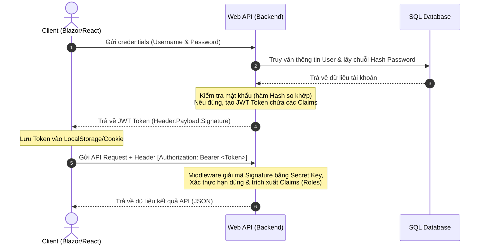

# TÀI LIỆU ÔN TẬP VÀ HƯỚNG DẪN TRẢ LỜI VẤN ĐÁP ĐỒ ÁN .NET & REACT/BLAZOR
## Dự án: Hệ thống Quản lý & Kinh doanh Thiết bị CNTT (HushStore)

> [!NOTE]
> Tài liệu này được tổng hợp và chuẩn hóa từ ghi chép thực tế của các nhóm đã tham gia vấn đáp đồ án. Nội dung được trình bày theo cấu trúc khoa học nhằm giúp bạn hiểu sâu bản chất kiến trúc hệ thống **HushStore** (ASP.NET Core Web API & Blazor WebAssembly) và trả lời xuất sắc trước hội đồng giám khảo.

---

## PHẦN 1: GIẢI THÍCH CHI TIẾT CÁC CÂU HỎI KỸ THUẬT (PHÂN LOẠI CHỦ ĐỀ)

### CHỦ ĐỀ A: CÚ PHÁP C# & LẬP TRÌNH HƯỚNG ĐỐI TƯỢNG (OOP)

#### 1. Tại sao lại có dấu `?` ở kiểu dữ liệu (data)?
Trong C#, dấu `?` biểu thị kiểu dữ liệu có thể nhận giá trị `null` (Nullable Types). Có hai loại chính cần phân biệt:
*   **Nullable Value Types (Kiểu giá trị cho phép null - có từ C# 2.0):** Áp dụng cho các kiểu dữ liệu dạng số, ngày tháng, logic (ví dụ: `int?`, `decimal?`, `DateTime?`, `bool?`). Bản chất là cấu trúc `Nullable<T>`.
    *   *Ứng dụng trong DB:* Ánh xạ tới cột cho phép chứa giá trị `NULL` trong SQL Server. Ví dụ: `decimal? OriginalPrice` trong lớp `ProductVariant` nghĩa là sản phẩm có thể không có giá trị giá gốc cũ (không giảm giá).
*   **Nullable Reference Types (Kiểu tham chiếu cho phép null - từ C# 8.0 trở đi):** Áp dụng cho các lớp, chuỗi (ví dụ: `string? LogoUrl`, `Category? Parent`). Khi bật tính năng này, C# yêu cầu dev khai báo rõ ràng biến nào có khả năng bị `null` để tránh lỗi kinh điển `NullReferenceException` khi biên dịch.
    *   *Ý nghĩa:* Giúp trình biên dịch đưa ra cảnh báo sớm nếu lập trình viên truy cập vào một thuộc tính có thể null mà chưa kiểm tra (`null check`).

#### 2. Vì sao phương thức `Set` (trong property/viewmodel) lại có 2 tham số, trong đó 1 tham số có từ khóa `ref`?
Đây là cấu trúc thường gặp khi triển khai mẫu **MVVM (Model-View-ViewModel)** hoặc các component trong Blazor Client khi cần quản lý trạng thái giao diện và cập nhật giao diện tự động.
*   **Cú pháp đặc trưng:** 
    ```csharp
    protected bool SetProperty<T>(ref T storage, T value, [CallerMemberName] string? propertyName = null)
    ```
*   **Giải thích chi tiết:**
    1.  **Tham số có `ref` (`ref T storage`):** Cho phép phương thức nhận vào **tham chiếu** trực tiếp của trường lưu trữ dữ liệu phía sau (backing field). Nhờ có `ref`, mọi thay đổi đối với `storage` bên trong hàm sẽ tác động và thay đổi trực tiếp giá trị của backing field đó ở lớp gọi.
    2.  **Tham số thứ hai (`T value`):** Là giá trị mới cần gán cho thuộc tính.
    3.  **Cơ chế hoạt động:** Phương thức sẽ so sánh giá trị hiện tại (`storage`) với giá trị mới (`value`). Nếu khác nhau, nó tiến hành gán `storage = value`, đồng thời kích hoạt sự kiện thông báo thay đổi thuộc tính (`PropertyChanged` hoặc kích hoạt Re-render UI). Nếu trùng giá trị cũ, hàm sẽ bỏ qua để tối ưu hiệu năng.

#### 3. Tại sao thuộc tính chỉ có `get` mà không có `set`?
Một thuộc tính chỉ có `get` (Read-only property) biểu thị một thuộc tính **chỉ đọc** sau khi được khởi tạo.
*   **Mục đích:**
    *   **Tính đóng gói (Encapsulation):** Bảo vệ dữ liệu bên trong đối tượng, ngăn chặn các tác nhân bên ngoài thay đổi trạng thái của thuộc tính một cách tùy tiện sau khi đối tượng đã được tạo.
    *   **Tính bất biến (Immutability):** Đảm bảo an toàn luồng dữ liệu, giúp code dễ dự đoán và ít phát sinh lỗi logic.
*   **Các trường hợp triển khai trong C#:**
    *   *Calculated Property (Thuộc tính tính toán):* Giá trị được tính toán trực tiếp từ các thuộc tính khác.
        ```csharp
        public string FullName => $"{FirstName} {LastName}";
        ```
    *   *Init-only Property (C# 9.0+):* Cho phép gán giá trị duy nhất một lần tại thời điểm khởi tạo đối tượng, sau đó thuộc tính trở thành chỉ đọc.
        ```csharp
        public int Id { get; init; }
        ```

#### 4. Từ khóa `using` dùng để làm gì?
Trong C#, từ khóa `using` có hai vai trò hoàn toàn khác nhau tùy thuộc vào ngữ cảnh sử dụng:
*   **Dùng làm Chỉ thị (Using Directive):** Đặt ở đầu file để import các namespace, giúp trình biên dịch hiểu được các lớp ta sử dụng nằm ở thư viện nào (ví dụ: `using System.Collections.Generic;`).
*   **Dùng làm Khối lệnh/Tuyên bố giải phóng tài nguyên (Using Statement / Using Declaration):**
    *   *Bản chất:* Được áp dụng cho các đối tượng thực thi interface `IDisposable` hoặc `IAsyncDisposable`.
    *   *Ý nghĩa:* Đảm bảo các **tài nguyên không được quản lý bởi bộ thu gom rác CLR** (Unmanaged Resources) như kết nối cơ sở dữ liệu (`DbContext`, `SqlConnection`), luồng đọc ghi file (`Stream`), kết nối mạng... sẽ **bắt buộc được giải phóng ngay lập tức** sau khi ra khỏi phạm vi khối lệnh `using`, kể cả khi có ngoại lệ (exception) xảy ra.
    *   *Cú pháp hiện đại (C# 8.0+):*
        ```csharp
        using var connection = new SqlConnection(connectionString);
        // Tự động giải phóng khi kết thúc phương thức chứa nó
        ```

#### 5. Lệnh `return` có tham số và không có tham số khác nhau như thế nào?
*   **`return;` (Không có tham số):** Chỉ được dùng trong các phương thức có kiểu trả về là `void` hoặc `Task`. Mục đích duy nhất là **thoát khỏi phương thức sớm** (early exit) khi gặp một điều kiện dừng nào đó, không trả về bất kỳ dữ liệu nào.
*   **`return value;` (Có tham số):** Bắt buộc phải dùng trong các phương thức có kiểu trả về cụ thể (ví dụ: `int`, `string`, `ApiResult<T>`, `IActionResult`). Nó tính toán giá trị của biểu thức `value` và trả về kết quả đó cho tác nhân gọi hàm, đồng thời kết thúc thực thi phương thức.

---

### CHỦ ĐỀ B: DEPENDENCY INJECTION (DI) & KIẾN TRÚC PHẦN MỀM

#### 6. Dependency Injection (DI) để làm gì? Quy trình hoạt động thế nào?
*   **Định nghĩa:** DI là một kỹ thuật (Design Pattern) nhằm thực hiện nguyên lý **Inversion of Control (IoC - Đảo ngược điều khiển)**. Thay vì một lớp tự khởi tạo các đối tượng phụ thuộc của nó bằng từ khóa `new` (gây ra sự phụ thuộc chặt chẽ - tight coupling), các phụ thuộc này sẽ được đưa từ ngoài vào thông qua Constructor (hàm dựng), Properties hoặc Parameters.
*   **Mục đích:**
    *   Giúp các thành phần trong phần mềm liên kết lỏng lẻo với nhau (loose coupling), dễ dàng thay đổi hoặc nâng cấp.
    *   Phục vụ đắc lực cho việc viết **Unit Test** nhờ khả năng mock (giả lập) các đối tượng phụ thuộc dễ dàng.
*   **Quy trình hoạt động của DI Container trong ASP.NET Core:**
    1.  **Đăng ký (Register):** Khai báo các dịch vụ và vòng đời của chúng với IoC Container trong file `Program.cs` (ví dụ: `builder.Services.AddScoped<IProductService, ProductService>();`).
    2.  **Yêu cầu (Resolve):** Khi một Controller yêu cầu phụ thuộc qua hàm dựng (ví dụ: `public ProductsController(IProductService productService)`), DI Container sẽ tự động quét danh sách dịch vụ đã đăng ký.
    3.  **Khởi tạo & Truyền vào (Inject):** DI Container tự tạo thực thể (instance) của lớp `ProductService` và truyền nó vào Constructor của Controller tại thời điểm runtime.

#### 7. Phân biệt các vòng đời (Lifetimes) trong DI: Transient, Scoped, Singleton? Khi nào dùng cái nào?
ASP.NET Core hỗ trợ 3 chế độ quản lý vòng đời của đối tượng:

| Vòng đời (Lifetime) | Cơ chế hoạt động | Khi nào sử dụng |
| :--- | :--- | :--- |
| **Transient** (`AddTransient`) | Mỗi khi có yêu cầu giải quyết phụ thuộc (resolve), một thực thể mới hoàn toàn sẽ được tạo ra. | Dùng cho các dịch vụ nhẹ, xử lý nhanh và không cần lưu trữ trạng thái (state-less). |
| **Scoped** (`AddScoped`) | Một thực thể duy nhất được tạo ra cho **mỗi yêu cầu HTTP (HTTP Request)**. Thực thể này được chia sẻ chung giữa các thành phần trong cùng request đó và bị hủy khi request kết thúc. | **Phổ biến nhất.** Dùng cho các lớp kết nối Database (`DbContext`), tầng `Repository`, và tầng nghiệp vụ `Service`. |
| **Singleton** (`AddSingleton`) | Một thực thể duy nhất được tạo ra ở lần yêu cầu đầu tiên và **tồn tại mãi mãi** trong suốt toàn bộ vòng đời của ứng dụng. | Dùng cho các dịch vụ cấu hình hệ thống, dịch vụ ghi log, bộ nhớ đệm dùng chung (`IMemoryCache`), hoặc Rate Limiting. |

> [!WARNING]
> **Lỗi Captive Dependency:** Cực kỳ nguy hiểm khi inject một Scoped Service (như `DbContext` hay `Service` nghiệp vụ) vào một Singleton Service. Vì Singleton tồn tại mãi mãi, nó sẽ giữ chặt lấy đối tượng Scoped bên trong nó, dẫn đến DbContext không bao giờ được giải phóng, gây rò rỉ bộ nhớ (memory leak) và xung đột kết nối dữ liệu!

#### 8. Tại sao đã có lớp `Service` rồi lại cần thêm lớp `Repository`? Nếu không dùng Repository thì sao?
Đây là mô hình **Repository & Unit of Work Pattern** kết hợp với **Service Layer** trong mô hình kiến trúc nhiều lớp (Clean Architecture).
*   **Trách nhiệm của từng lớp:**
    *   **Repository Layer (Tầng dữ liệu):** Đóng vai trò cầu nối giữa Entity Framework Core và Database. Lớp này chỉ chứa các truy vấn thô, thao tác CRUD trực tiếp trên bảng và ẩn giấu đi các câu lệnh LINQ phức tạp.
    *   **Service Layer (Tầng nghiệp vụ):** Nhận DTO từ API, điều phối hoạt động của một hoặc nhiều Repository, thực hiện các quy tắc kiểm tra logic nghiệp vụ phức tạp (Business Rules), xử lý giao dịch (Transactions), quản lý logs và trả về cấu hình dữ liệu chuẩn (`ApiResult`).
*   **Nếu không có Repository Pattern?**
    *   Tầng Service sẽ phải gọi trực tiếp `DbContext` của Entity Framework Core để thực hiện các truy vấn dữ liệu.
    *   *Hệ lụy:*
        1.  **Tightly Coupled:** Code nghiệp vụ bị phụ thuộc hoàn toàn vào công nghệ EF Core. Nếu sau này muốn chuyển sang Dapper hoặc công nghệ khác, ta phải sửa code ở toàn bộ tầng Service.
        2.  **Khó viết Unit Test:** Việc giả lập (mock) một `DbContext` và `DbSet` phức tạp hơn rất nhiều so với việc mock một interface đơn giản như `IProductRepository`.
        3.  **Trùng lặp code:** Các câu lệnh lọc phức tạp (ví dụ: lọc sản phẩm chưa bị xóa `!IsDeleted`) sẽ bị lặp lại ở nhiều Service khác nhau.

#### 9. Tại sao phải viết hàm dựng (Constructor) cho API Controller?
API Controller trong ASP.NET Core không tự thực thi nghiệp vụ trực tiếp mà phải thông qua tầng Service (lớp trung gian). 
Việc viết hàm dựng cho Controller giúp ta khai báo các phụ thuộc cần thiết (như `IProductService`, `ILogger`). Khi có request gửi đến, ASP.NET Core sẽ tự động khởi tạo Controller bằng cách tìm kiếm các phụ thuộc này từ DI Container và đẩy vào thông qua hàm dựng đó. Cú pháp này được gọi là **Constructor Injection**.

#### 10. Tại sao tất cả các Controller hay Model lại kế thừa Base Class (`ControllerBase` / `BaseViewModel` / `BaseEntity`)?
Đây là nguyên lý **Kế thừa (Inheritance)** trong OOP để tái sử dụng mã nguồn và chuẩn hóa cấu trúc:
*   **`ControllerBase` (của ASP.NET Core):** Cung cấp các thuộc tính và phương thức trợ giúp cốt lõi để xử lý HTTP Request như đọc thông tin User đăng nhập, trả về các mã trạng thái HTTP chuẩn (`Ok()`, `BadRequest()`, `NotFound()`, `Redirect()`).
*   **`BaseEntity` (trong lõi database - nếu có):** Chứa các trường thông tin kiểm toán (Audit Fields) chung mà bảng nào cũng cần như: `Id`, `CreatedDate`, `CreatedBy`, `ModifiedDate`, `ModifiedBy`, `IsDeleted` (phục vụ xóa mềm). Thay vì khai báo lặp đi lặp lại ở mọi thực thể, ta chỉ cần khai báo một lần ở `BaseEntity` và cho các thực thể khác kế thừa.
*   **`BaseViewModel` (phía Client):** Định nghĩa các biến quản lý trạng thái UI dùng chung như `IsLoading` (đang tải), `ErrorMessage` (thông báo lỗi) và triển khai sự kiện cập nhật giao diện `INotifyPropertyChanged`.

#### 11. Mối liên hệ giữa Swagger và API trong Controller là gì?
*   **Swagger (OpenAPI Specification):** Là công cụ tự động quét toàn bộ cấu trúc mã nguồn của API (thông qua các Route, HTTP Verbs như `[HttpGet]`, `[HttpPost]`, tham số truyền vào và kiểu dữ liệu phản hồi `[ProducesResponseType]`).
*   **Mối liên hệ:** Swagger dựa vào các siêu dữ liệu (metadata) được khai báo trực tiếp trên Controller để tự động biên soạn thành một file đặc tả định dạng JSON/YAML. Từ file này, giao diện tương tác Swagger UI được sinh ra, giúp lập trình viên Frontend hoặc kiểm thử viên có thể đọc tài liệu, chạy thử các API trực tiếp trên trình duyệt mà không cần sử dụng phần mềm bên ngoài như Postman.

---

### CHỦ ĐỀ C: ENTITY FRAMEWORK (EF) CORE & TRUY VẤN LINQ

#### 12. Phương thức `Db.Create` hoặc `EnsureCreated` là do .NET cung cấp hay do lập trình viên viết?
*   Nếu là phương thức `_context.Database.EnsureCreated()`: Đây là phương thức **do Entity Framework Core (.NET) cung cấp**, dùng để tự động tạo cơ sở dữ liệu vật lý dựa trên các Model đã cấu hình nếu cơ sở dữ liệu đó chưa tồn tại trên Server.
*   Nếu là một hàm dạng `Db.Create()` hay `DbInitializer.Initialize()`: Đây là phương thức **do lập trình viên tự viết** nhằm thực hiện việc chèn dữ liệu mẫu ban đầu (Seed Data) như tài khoản Admin mặc định, các phân hệ Role, hoặc danh mục sản phẩm mẫu ngay sau khi database được khởi tạo thành công.

#### 13. Phương thức `.Include()` dùng để làm gì trong LINQ?
*   **Bản chất:** `.Include()` (và `.ThenInclude()`) dùng để kích hoạt cơ chế **Eager Loading (Tải chủ động)** trong Entity Framework Core.
*   **Ý nghĩa:** Nó chỉ thị cho EF Core tạo ra các câu lệnh SQL sử dụng phép nối `JOIN` để truy vấn và nạp đồng thời dữ liệu từ các bảng có quan hệ khóa ngoại vào đối tượng kết quả ngay trong một câu lệnh truy vấn duy nhất.
    *   *Ví dụ:* `_context.Products.Include(p => p.Manufacturer).ToList()` sẽ lấy thông tin chi tiết của sản phẩm kèm theo luôn toàn bộ thông tin của nhà sản xuất tương ứng.
*   **So sánh:** Tránh lỗi **N+1 Query** nguy hiểm của Lazy Loading (cứ mỗi vòng lặp lấy thông tin liên quan lại phát sinh thêm một câu lệnh SQL truy vấn riêng lẻ gây nghẽn băng thông truyền tải).

> [!TIP]
> **Tối ưu hóa hiệu năng:** Mặc dù `.Include()` rất tiện lợi nhưng lạm dụng nó trên các bảng có dữ liệu lớn hoặc quan hệ lồng nhau quá sâu sẽ tạo ra hiện tượng **Bùng nổ dữ liệu (Cartesian Product)** ở phía SQL Server. Chuẩn doanh nghiệp khuyến khích sử dụng **Projection** (dùng lệnh `.Select()` để ánh xạ trực tiếp sang DTO) thay vì dùng `.Include()`.

#### 14. Fluent API và Data Annotations là gì? Nếu dùng cả hai thì sao?
Đây là hai phương pháp định nghĩa cấu hình ánh xạ giữa thực thể C# (Entities) và bảng cơ sở dữ liệu (Database Schemas) trong EF Core.
*   **Data Annotations:** Dùng các thuộc tính (Attributes) đặt trực tiếp ngay trên thuộc tính của Class.
    *   *Ví dụ:* `[Key]`, `[Required]`, `[MaxLength(100)]`.
    *   *Đánh giá:* Nhanh, trực quan, dễ viết nhưng làm "bẩn" lớp Entity vì bị phụ thuộc vào namespace của DataAnnotations. Không thể cấu hình các quan hệ phức tạp.
*   **Fluent API:** Cấu hình thông qua mã C# bằng cách ghi đè phương thức `OnModelCreating` trong DbContext.
    *   *Ví dụ:* `modelBuilder.Entity<Product>().HasKey(p => p.Id);`
    *   *Đánh giá:* Cực kỳ mạnh mẽ, hỗ trợ 100% các tính năng nâng cao của DB (khóa chính phức hợp, chỉ mục Index, khóa ngoại phức tạp, tự động lọc Soft Delete). Giúp thực thể C# thuần khiết và sạch sẽ.
*   **Nếu dùng cả hai:** Hoàn toàn được. Tuy nhiên, **Fluent API luôn có độ ưu tiên cao nhất**. Nếu có sự xung đột cấu hình (ví dụ: Data Annotations khai báo độ dài tối đa là 50 nhưng Fluent API cấu hình là 100), EF Core sẽ lấy cấu hình của Fluent API làm chuẩn.

#### 15. Phương thức `OnModelCreating` dùng để làm gì?
Là một phương thức ảo (virtual) nằm trong lớp `DbContext` của EF Core. Lập trình viên override phương thức này để:
*   Định nghĩa lược đồ cấu hình cho Database bằng **Fluent API**.
*   Thiết lập mối quan hệ giữa các thực thể (1-1, 1-N, N-N).
*   Cấu hình chỉ mục (`Index`) giúp tăng tốc độ tìm kiếm dữ liệu.
*   Thiết lập cơ chế **Global Query Filter** (bộ lọc truy vấn toàn cục). Ví dụ: luôn tự động lọc bỏ các bản ghi có trạng thái xóa mềm `IsDeleted == true` trên mọi câu lệnh LINQ mà không cần viết điều kiện thủ công.
*   Gắn mã nạp dữ liệu mặc định ban đầu (`HasData`) để tự động chèn dữ liệu mẫu khi chạy Migrations.

#### 16. Phân biệt `FirstOrDefault` và `FirstOrDefaultAsync`? Tương tự với `SaveChanges` và `SaveChangesAsync`?
Sự khác biệt cốt lõi nằm ở **Cơ chế xử lý bất đồng bộ (Asynchronous Programming)**:

| Phương thức Đồng bộ (`Sync`) | Phương thức Bất đồng bộ (`Async`) |
| :--- | :--- |
| **`FirstOrDefault()`** / **`SaveChanges()`** | **`FirstOrDefaultAsync()`** / **`SaveChangesAsync()`** |
| Chặn đứng (Block) luồng thực thi hiện tại của CPU để chờ đợi kết quả phản hồi từ Database Server hoặc hoàn tất ghi đĩa. | CPU gửi truy vấn đi, giải phóng luồng hiện tại để quay về Thread Pool phục vụ các yêu cầu HTTP khác. Khi Database phản hồi xong, một luồng tự do sẽ nhận lại tác vụ và chạy tiếp code phía sau. |
| Làm giảm khả năng chịu tải (throughput) của API. Nếu có nhiều request đồng thời truy cập, hệ thống dễ bị cạn kiệt luồng xử lý (Thread Pool Starvation). | Giúp hệ thống ASP.NET Core nâng cao khả năng mở rộng tối đa, phục vụ được hàng ngàn kết nối đồng thời với lượng tài nguyên phần cứng tối thiểu. |

#### 17. Lập trình bất đồng bộ (`async`/`await` và `Task`) hoạt động thế nào? Ứng dụng thực tế làm gì?
*   **Cơ chế hoạt động:**
    *   Khi một phương thức được đánh dấu từ khóa `async`, nó cho phép sử dụng từ khóa `await` bên trong. Kiểu trả về của nó phải bọc trong một đối tượng `Task` hoặc `Task<T>`.
    *   Tại thời điểm gặp từ khóa `await`, hệ thống nhận diện đây là một tác vụ tiêu tốn thời gian I/O (không tốn CPU tính toán). Nó lưu lại ngữ cảnh thực thi (State Machine) và lập tức trả luồng xử lý về cho hệ điều hành. Khi tác vụ I/O chạy xong, hệ thống đánh tín hiệu để đánh thức State Machine tiếp tục chạy.
*   **Ứng dụng thực tế trong dự án HushStore:**
    *   Khi khách hàng thực hiện thanh toán hóa đơn sửa chữa (checkout): Hệ thống vừa phải lưu thông tin vào DB (`await SaveChangesAsync()`), vừa phải gọi API sang cổng thanh toán thứ ba, vừa gửi email xác nhận.
    *   Nếu dùng đồng bộ, khách hàng sẽ bị đơ màn hình chờ đợi rất lâu. Dùng bất đồng bộ kết hợp chạy song song giúp màn hình giao diện cực kỳ mượt mà, phản hồi ngay lập tức.

#### 18. Phương thức `AsQueryable()` để làm gì trong LINQ?
*   **Ý nghĩa:** Chuyển đổi một danh sách hoặc truy vấn về dạng `IQueryable<T>`. 
*   **Mục đích:** Kích hoạt cơ chế **Hoãn thực thi (Deferred Execution)**.
*   **Cơ chế hoạt động:** Khi bạn thao tác lọc (`.Where()`), sắp xếp (`.OrderBy()`), phân trang (`.Skip()`, `.Take()`) trên một đối tượng `IQueryable`, EF Core chỉ xây dựng cây biểu thức điều kiện (Expression Tree) mà **chưa hề chạy câu lệnh xuống Database**. Chỉ khi nào ta yêu cầu lấy dữ liệu thực tế bằng các hàm kết thúc như `.ToList()`, `.ToListAsync()`, `.Count()` hoặc duyệt vòng lặp `foreach`, lúc đó EF Core mới biên dịch toàn bộ cây biểu thức thành một câu lệnh SQL duy nhất và tối ưu nhất để thực thi tại Database Server.
    *   *Ví dụ thực tế:* Giúp thực hiện phân trang và tìm kiếm ở phía SQL Server, chỉ tải đúng 10 bản ghi cần hiển thị lên bộ nhớ Web API thay vì tải toàn bộ bảng dữ liệu lên RAM rồi mới lọc.

#### 19. Phương thức `ToDictionary()` trong LINQ dùng để làm gì?
*   **Ý nghĩa:** Chuyển đổi một danh sách kết quả LINQ thành một cấu trúc dữ liệu kiểu `Dictionary<TKey, TValue>` (gồm cặp khóa và giá trị).
*   **Đặc điểm:** Lệnh này thực thi câu lệnh truy vấn ngay lập tức xuống DB (Immediate Execution).
*   **Ứng dụng:** Giúp tăng tốc độ tìm kiếm phần tử theo từ khóa (Key). Thay vì phải duyệt tuần tự qua danh sách $O(N)$, việc tra cứu trong Dictionary chỉ tốn chi phí thời gian là $O(1)$. Thường dùng khi cần map nhanh dữ liệu danh mục tĩnh hoặc ánh xạ các mối quan hệ tạm thời trên bộ nhớ.

#### 20. Câu lệnh SQL được dịch từ LINQ như thế nào? Cho ví dụ cụ thể?
EF Core tích hợp sẵn một công cụ biên dịch (Query Provider). Nó phân tích cú pháp biểu thức LINQ viết bằng C# và dịch thành câu lệnh SQL tương đương phù hợp với hệ quản trị cơ sở dữ liệu đang dùng (SQL Server, PostgreSQL...).

*   **Ví dụ 1: Câu lệnh lọc theo điều kiện**
    *   *C# LINQ:*
        ```csharp
        var products = _context.Products.Where(p => p.CategoryId == 1 && !p.IsDeleted).ToList();
        ```
    *   *SQL tương ứng:*
        ```sql
        SELECT [p].[Id], [p].[Name], [p].[Price], [p].[CategoryId]
        FROM [Products] AS [p]
        WHERE [p].[CategoryId] = 1 AND [p].[IsDeleted] = 0
        ```
*   **Ví dụ 2: Lấy phần tử đầu tiên theo Id (`FirstOrDefault`)**
    *   *C# LINQ:*
        ```csharp
        var product = _context.Products.FirstOrDefault(p => p.Id == 5);
        ```
    *   *SQL tương ứng:*
        ```sql
        SELECT TOP(1) [p].[Id], [p].[Name], [p].[Price]
        FROM [Products] AS [p]
        WHERE [p].[Id] = 5
        ```

---

### CHỦ ĐỀ D: ASP.NET CORE MVC & WEB API

#### 21. Phân biệt ViewBag, ViewData và TempData?

| Đặc điểm | ViewData | ViewBag | TempData |
| :--- | :--- | :--- | :--- |
| **Bản chất** | Là một Dictionary (`ViewDataDictionary`), truy cập thông qua các Key kiểu chuỗi. | Là một đối tượng động (`DynamicViewDataWrapper`) tận dụng tính năng `dynamic` của C#. | Sử dụng bộ lưu trữ Session (hoặc Cookie) phía sau. |
| **Cú pháp** | `ViewData["Title"] = "HushStore";` | `ViewBag.Title = "HushStore";` | `TempData["Success"] = "Đăng nhập thành công!";` |
| **Ép kiểu** | Phải ép kiểu thủ công khi đọc dữ liệu ở View. | Không cần ép kiểu vì trình biên dịch giải quyết kiểu dữ liệu tại runtime. | Phải ép kiểu khi đọc. |
| **Vòng đời** | Chỉ tồn tại trong **HTTP Request hiện tại**. | Chỉ tồn tại trong **HTTP Request hiện tại**. | Tồn tại qua một lượt chuyển hướng trang trang kế tiếp (**Redirect**). Sẽ tự hủy sau khi dữ liệu được đọc. |

#### 22. So sánh `Return View()` và `Return RedirectToAction()`?
*   **`Return View()`**:
    *   *Cơ chế:* Chỉ thị cho Server tìm kiếm file giao diện `.cshtml` tương ứng, biên dịch nó thành mã HTML kèm dữ liệu rồi trả thẳng về cho trình duyệt.
    *   *Trạng thái:* URL trên trình duyệt **không thay đổi**. Không tạo thêm Request mới.
*   **`Return RedirectToAction()`**:
    *   *Cơ chế:* Server gửi về trình duyệt một phản hồi HTTP có mã trạng thái là **302 Found (Redirect)** chỉ định địa chỉ của một Action mới. Trình duyệt nhận mã này sẽ lập tức tạo ra một **HTTP GET Request mới** hoàn toàn hướng tới Action đó.
    *   *Trạng thái:* URL trên trình duyệt **thay đổi** sang trang mới.
    *   *Ứng dụng quan trọng:* Áp dụng mẫu thiết kế **PRG (Post-Redirect-Get)** để giải quyết lỗi khi người dùng F5 tải lại trang không bị gửi trùng lặp dữ liệu submit form (ví dụ như tạo đơn hàng 2 lần).

#### 23. Tại sao chức năng chỉnh sửa (Edit) lại có hai Action: một cái GET và một cái POST?
Đây là thiết kế tuân thủ mô hình chuẩn của kiến trúc Web nhằm đảm bảo tính bảo mật và phân chia trách nhiệm rõ ràng (Separation of Concerns):
*   **Action GET (Hiển thị Form):**
    *   *Nhiệm vụ:* Tiếp nhận Id của đối tượng cần sửa, truy cập Database lấy thông tin hiện tại và đổ dữ liệu vào Form chỉnh sửa để hiển thị cho người dùng.
    *   *Tính chất:* An toàn (Safe) và Idempotent. Chỉ đọc dữ liệu, không làm thay đổi trạng thái của hệ thống.
*   **Action POST (Xử lý dữ liệu gửi lên):**
    *   *Nhiệm vụ:* Tiếp nhận dữ liệu do người dùng submit từ Form, thực hiện kiểm tra tính hợp lệ (Validation). Nếu hợp lệ, tiến hành cập nhật vào Database và chuyển hướng trang.
    *   *Tính chất:* Không an toàn (Unsafe). Làm thay đổi trực tiếp trạng thái cơ sở dữ liệu.

#### 24. Cấu trúc đường dẫn URL (Endpoint) chuẩn RESTful là gì? Tại sao phải thiết kế chung như `/api/v1/user`?
*   **RESTful URL Standard:** URL được thiết kế tập trung vào **Tài nguyên (Resources)** chứ không phải Hành động (Actions). Tài nguyên được định dạng bằng danh từ số nhiều.
    *   *Ví dụ đúng:* `GET /api/v1/products` (Lấy danh mục sản phẩm), `POST /api/v1/products` (Tạo sản phẩm), `GET /api/v1/products/5` (Chi tiết sản phẩm 5).
    *   *Ví dụ sai:* `/api/v1/getAllProducts`, `/api/v1/deleteProduct?id=5`.
*   **Tại sao cần thiết kế chung có tiền tố `/api/v1/[controller]`?**
    1.  **Tính nhất quán (Consistency):** Giúp Frontend phát triển nhanh chóng vì dễ dàng đoán trước được cấu trúc URL của các API mới.
    2.  **Quản lý phiên bản (Versioning):** Ký tự `v1` giúp hệ thống dễ dàng nâng cấp lên `v2` khi có những thay đổi lớn về cấu trúc dữ liệu mà không làm hỏng (break) các phiên bản ứng dụng cũ đang hoạt động.
    3.  **Tách biệt ứng dụng:** Định vị rõ ràng đây là các API cung cấp dữ liệu JSON, phân biệt rõ với các luồng dẫn trang HTML tĩnh.

#### 25. Cấu hình định tuyến (Routing) nằm ở đâu trong dự án? Tại sao khi chạy thử ở máy local lại xuất hiện 2 Host khác nhau?
*   **Nơi cấu hình Routing:**
    *   *Phía Backend API:* Đăng ký định tuyến tự động bằng thuộc tính `app.MapControllers()` trong `Program.cs`. Trên từng Controller, sử dụng các Attribute định tuyến như `[Route("api/[controller]")]` kết hợp `[HttpGet("{id:int}")]`.
    *   *Phía Client Blazor WASM:* Cấu hình trực tiếp ở dòng đầu tiên của mỗi tệp Razor Component bằng từ khóa `@page "/duong-dan"`.
*   **Tại sao lại chạy thành 2 Host (2 cổng Port khác nhau)?**
    *   Vì dự án được xây dựng theo kiến trúc **Decoupled (Client-Server Split - Tách rời hoàn toàn)**.
    *   **Host 1 (Cổng API - ví dụ `https://localhost:5001`):** Là Server Backend đóng vai trò như một kho dịch vụ, chuyên xử lý logic nghiệp vụ và trả về dữ liệu thô dạng JSON.
    *   **Host 2 (Cổng Client - ví dụ `https://localhost:5002`):** Là máy chủ phân phối mã nguồn giao diện (HTML/CSS/JS/WebAssembly). Trình duyệt tải giao diện từ Host này về máy người dùng, sau đó chạy các đoạn mã HTTP Client để gọi ngầm lấy dữ liệu từ Host API.

#### 26. Đối tượng `HttpContext` dùng để làm gì?
`HttpContext` là một lớp cực kỳ quan trọng trong ASP.NET Core, đóng gói toàn bộ thông tin chi tiết về một **yêu cầu HTTP đơn lẻ** đang được xử lý.
*   **Nó chứa các thông tin:**
    *   `Request`: Chứa HTTP Method (GET/POST), Headers, Cookies, QueryString, Body của request gửi lên.
    *   `Response`: Dùng để cấu hình dữ liệu trả về cho client (Headers, Cookies, Status Code).
    *   `User`: Chứa danh tính, các quyền hạn và thông tin Claims của người dùng đã được xác thực (đọc từ JWT Token).
    *   `Items`: Một kho lưu trữ dạng Dictionary tạm thời để truyền dữ liệu qua lại giữa các Middleware trong cùng một HTTP Request.
*   **Ứng dụng:** Viết Middleware bắt lỗi toàn cục, trích xuất Token để kiểm tra IP Client, thiết lập ngôn ngữ hiển thị.

#### 27. Phân biệt HTTP Methods: GET vs POST, PUT vs PATCH?
Đây là các phương thức HTTP chuẩn dùng để thực thi các hành động trên tài nguyên:
*   **GET vs POST:**
    *   `GET`: Chỉ dùng để truy vấn, lấy dữ liệu về. Tham số đính trực tiếp trên URL. Có giới hạn độ dài, được trình duyệt lưu cache. An toàn và Idempotent.
    *   `POST`: Dùng để tạo mới một tài nguyên. Tham số được giấu trong HTTP Body. Không giới hạn độ dài. Không an toàn và không Idempotent (gửi 2 lần sẽ tạo 2 bản ghi mới).
*   **PUT vs PATCH:**
    *   `PUT`: Cập nhật lại **toàn bộ tài nguyên**. Client phải gửi lên toàn bộ các trường dữ liệu của đối tượng. Nếu thiếu trường nào, trường đó sẽ bị ghi đè về giá trị mặc định (`null` hoặc `0`).
    *   `PATCH`: Cập nhật **một phần tài nguyên**. Client chỉ cần gửi lên các trường thực sự cần thay đổi (ví dụ: chỉ sửa giá tiền sản phẩm, giữ nguyên tên và mô tả). Giúp tiết kiệm băng thông và tối ưu hiệu năng.

---

### CHỦ ĐỀ E: XÁC THỰC (AUTHENTICATION) & PHÂN QUYỀN (AUTHORIZATION)

#### 28. Cơ chế Authentication bằng Token hoạt động như thế nào khi đăng nhập? Trình bày luồng hoạt động của JWT?
Hệ thống **HushStore** sử dụng cơ chế xác thực không trạng thái (Stateless Authentication) dựa trên **JWT (JSON Web Token)**.



*   **Cơ chế mã hóa JWT:** Token gồm 3 phần phân cách bởi dấu chấm `.`:
    1.  **Header:** Khai báo thuật toán mã hóa chữ ký (ví dụ: HS256).
    2.  **Payload (Claims):** Chứa thông tin công khai của User như `UserId`, `Username`, `Roles`, thời gian hết hạn (`exp`). Phần này chỉ được mã hóa Base64 nên tuyệt đối không chứa thông tin nhạy cảm như mật khẩu.
    3.  **Signature (Chữ ký số):** Được tạo bằng cách lấy (Header + Payload) kết hợp với một chuỗi khóa bí mật (**Secret Key**) lưu duy nhất ở Server Backend để băm lại. Giúp Server phát hiện ngay lập tức nếu Token bị sửa đổi trái phép ở Client.

#### 29. Phân biệt Authentication (Xác thực) và Authorization (Phân quyền)? Chúng hoạt động thế nào trong ASP.NET Core?
*   **Authentication (Xác thực - Bạn là ai?):** Là quá trình xác minh danh tính của một thực thể truy cập vào hệ thống (ví dụ: kiểm tra xem tài khoản/mật khẩu có đúng không, mã Token JWT gửi kèm theo có hợp lệ và còn hạn sử dụng không).
*   **Authorization (Phân quyền - Bạn được làm gì?):** Diễn ra **sau** khi đã xác thực thành công. Hệ thống kiểm tra xem thực thể đã biết danh tính này có quyền hạn (Roles hoặc Policies) phù hợp để thực thi hành động hay truy cập tài nguyên yêu cầu không (ví dụ: chỉ tài khoản có Role `Admin` mới được vào API xóa sản phẩm).
*   **Cơ chế hoạt động trong ASP.NET Core:**
    *   Trong `Program.cs`, hai Middleware cốt lõi phải được đăng ký theo đúng thứ tự bắt buộc:
        ```csharp
        app.UseAuthentication(); // Chạy trước để giải mã Token xem là ai
        app.UseAuthorization();  // Chạy sau để so khớp quyền hạn
        ```
    *   Trên các Controller, sử dụng các thuộc tính đánh dấu:
        *   `[Authorize]`: Bắt buộc phải đăng nhập.
        *   `[Authorize(Roles = "Admin,Employee")]`: Bắt buộc đăng nhập và phải có một trong các vai trò được liệt kê.
        *   `[AllowAnonymous]`: Cho phép truy cập công khai không cần tài khoản (ví dụ: xem danh sách sản phẩm).

#### 30. Mật khẩu người dùng khi đăng ký/đăng nhập có được mã hóa không? Giải thích cơ chế?
*   **Bắt buộc 100% phải mã hóa một chiều (Hashing)**. Hệ thống không bao giờ được phép lưu trữ mật khẩu thô trong cơ sở dữ liệu để phòng ngừa rủi ro nếu database bị rò rỉ.
*   **Cơ chế hoạt động (chuẩn ASP.NET Core Identity):**
    *   Sử dụng thuật toán băm mật khẩu một chiều cực mạnh (như PBKDF2 với HMAC-SHA256, BCrypt, hoặc Argon2). Một khi đã băm thì không bao giờ có thể giải mã ngược lại thành mật khẩu thô.
    *   **Cơ chế Salt (Muối):** Khi người dùng đăng ký, hệ thống tự động sinh ra một chuỗi ký tự ngẫu nhiên duy nhất gọi là `Salt`. Mật khẩu thô sẽ được cộng chuỗi với `Salt` này rồi mới đưa vào hàm băm. Điều này giúp ngăn chặn triệt để hình thức tấn công dò tìm bằng bảng tra cứu trước (Rainbow Table Attack).
    *   **Quá trình kiểm tra đăng nhập:** 
        1. Người dùng nhập mật khẩu thô.
        2. Server lấy chuỗi `Salt` tương ứng của tài khoản đã lưu trong DB ra.
        3. Thực hiện băm mật khẩu mới nhập cùng với `Salt` đó.
        4. So sánh hai chuỗi băm thu được. Nếu trùng khớp hoàn toàn, xác nhận mật khẩu đúng.

---

### CHỦ ĐỀ F: GIAO DIỆN (FRONTEND) & TRẢI NGHIỆM NGƯỜI DÙNG

#### 31. Trên giao diện (Frontend), việc bắt và xử lý sự kiện diễn ra như thế nào?
Dự án sử dụng cơ chế **Data Binding (Ràng buộc dữ liệu)** và **Event Handling (Xử lý sự kiện)** của framework Frontend (Blazor WebAssembly kết hợp MudBlazor):
*   **Ràng buộc dữ liệu 2 chiều (`@bind-Value`):** Giúp đồng bộ hóa tự động trạng thái dữ liệu. Khi người dùng nhập ký tự vào ô Textbox trên màn hình, giá trị của biến C# tương ứng ở code-behind sẽ lập tức thay đổi và ngược lại.
*   **Bắt sự kiện (Event Handling):** Sử dụng các cú pháp `@onclick`, `@onchange`, `@onkeypress` để liên kết hành động của người dùng (như click chuột vào nút "Thêm vào giỏ hàng") với một phương thức xử lý C#.
*   **Quy trình chạy:** Người dùng tương tác -> Trình kích hoạt sự kiện chạy hàm C# -> Hàm thực hiện xử lý logic, gọi API lấy dữ liệu mới -> Cập nhật State -> Gọi phương thức yêu cầu trình duyệt vẽ lại giao diện (Re-render UI) để hiển thị thông tin mới nhất.

#### 32. Hệ thống phân trang (Pagination) ở giao diện hoạt động theo cơ chế nào?
Hệ thống sử dụng cơ chế **Server-side Pagination (Phân trang phía máy chủ)** để tối ưu hiệu năng đối với các danh mục dữ liệu lớn (như danh sách sản phẩm hay danh sách hóa đơn lịch sử).
*   **Cơ chế hoạt động:**
    1.  **Frontend quản lý:** Giữ các trạng thái gồm `PageIndex` (trang hiện tại, ví dụ: 2) và `PageSize` (số lượng phần tử trên mỗi trang, ví dụ: 12).
    2.  **Gửi yêu cầu:** Khi người dùng bấm nút chuyển trang, Frontend tạo một yêu cầu HTTP gửi đến API kèm tham số truy vấn: `/api/products?pageNumber=2&pageSize=12`.
    3.  **Backend xử lý:** EF Core dịch truy vấn dùng LINQ `.Skip((pageNumber - 1) * pageSize).Take(pageSize)` để chỉ lôi đúng 12 bản ghi tương ứng lên khỏi database, đồng thời đếm tổng số bản ghi bằng `.Count()`.
    4.  **Phản hồi:** API trả về một đối tượng bọc chung dạng `PagedResult<ProductListDto>` chứa: danh sách 12 sản phẩm và thuộc tính `TotalCount`.
    5.  **Render UI:** Giao diện nhận kết quả, hiển thị 12 sản phẩm lên màn hình và dùng `TotalCount` để tự động vẽ ra đúng số lượng các nút trang (ví dụ: Tổng 120 sản phẩm, mỗi trang 12 cái thì vẽ 10 nút trang).

---

## PHẦN 2: NHẬT KÝ THỰC CHIẾN & KINH NGHIỆM VẤN ĐÁP ĐỒ ÁN
*(Đúc kết từ bài học thực tế từ các nhóm bảo vệ trước)*

### 1. Chiến thuật trình bày codebase để ghi điểm tuyệt đối
*   **Chủ động dẫn dắt:** Khi thầy yêu cầu trình bày code, hãy chủ động giới thiệu cấu trúc tổng thể trước khi thầy hỏi chi tiết. Hãy chỉ rõ cấu trúc thư mục của dự án tuân thủ đúng mô hình **Clean Architecture**:
    *   `Core`: Chỉ chứa thực thể nghiệp vụ thuần túy và Interface.
    *   `Shared`: Chứa DTOs và FluentValidation để cả Frontend và Backend dùng chung (giúp giảm thiểu công sức gõ code validate 2 lần).
    *   `Infrastructure`: Chứa EF Core DbContext và cấu hình ánh xạ DB.
    *   `Service`: Nơi tập trung toàn bộ Business Logic của hệ thống.
    *   `API`: Tầng giao tiếp, chỉ nhận request và gọi Service.
*   **Nói lời nịnh khéo đầy tinh tế:** *"Bọn em đã nghiên cứu rất kỹ các mô hình tổ chức thư mục chuẩn doanh nghiệp kết hợp với những chỉ dẫn cấu trúc của thầy trên lớp để thiết kế ra kiến trúc này. Nhờ đó nhóm em làm việc nhóm rất hiệu quả, phân chia công việc rõ ràng không bị xung đột code trên Git."*

### 2. Cách trả lời thông minh khi bị hỏi về Controller
*   **Hỏi:** *Tại sao các Controller của em viết ngắn vậy? Sao không viết xử lý lưu DB luôn trong này?*
    *   **Trả lời:** *"Dạ thưa thầy, theo nguyên lý thiết kế Single Responsibility (Đơn trách nhiệm), Controller chỉ nên đóng vai trò là cửa ngõ giao tiếp của hệ thống (API Gateway) - nhận yêu cầu, kiểm tra cơ bản đầu vào và định tuyến kết quả trả về. Toàn bộ logic nghiệp vụ, giao dịch DB tụi em đều chuyển hết xuống lớp **Service** xử lý độc lập để sau này nếu cần làm app di động hay kết nối dịch vụ khác, tụi em có thể tái sử dụng nguyên vẹn logic nghiệp vụ mà không cần viết lại."*

### 3. Cách ứng phó câu hỏi về khâu Validate dữ liệu (Vùng nhạy cảm dễ bị trừ điểm)
*   **Tình huống nguy hiểm:** Thầy hỏi *"Ở Controller em đã khai báo Check Role rồi, vậy ở tầng Service em có cần kiểm tra hay validate dữ liệu gì nữa không?"*
*   **Cách trả lời cứu nguy:** 
    *   *KHÔNG ĐƯỢC TRẢ LỜI LÀ KHÔNG CẦN.* 
    *   *Trả lời chuẩn:* *"Dạ thưa thầy, có chứ ạ. Hệ thống của tụi em thực hiện kiểm tra dữ liệu ở **3 tầng bảo vệ nghiêm ngặt**:*
        1.  **Tầng Frontend:** Kiểm tra định dạng dữ liệu đầu vào ngay tại giao diện để đưa ra cảnh báo nhanh, giúp nâng cao trải nghiệm người dùng.
        2.  **Tầng API (FluentValidation):** Sử dụng các Validator độc lập để tự động kiểm tra cú pháp dữ liệu gửi lên (ví dụ: kiểm tra định dạng email, mật khẩu đủ độ dài).
        3.  **Tầng Service (Nghiệp vụ):** Đây là chốt chặn quan trọng nhất. Tầng này sẽ kiểm tra các quy tắc nghiệp vụ chuyên sâu (Business Rules) như: Kiểm tra xem ID thực thể gửi lên có tồn tại trong DB không, số lượng serial trong kho có đủ để xuất hóa đơn không, và đặc biệt là kiểm tra quyền sở hữu tài nguyên (**Ownership validation** - xem ID của User đăng nhập có đúng là người sở hữu hóa đơn đó không để ngăn chặn hoàn toàn lỗ hổng bảo mật IDOR)."*

### 4. Giải thích về lỗi Swagger không nhận diện hoặc hiển thị lỗi
*   **Tình huống:** Thầy hỏi *"Làm sao để Swagger hiện được các mã lỗi chi tiết và cấu trúc dữ liệu phản hồi của API?"*
*   **Trả lời:** *"Dạ để Swagger nhận diện và hiển thị tài liệu API một cách tường minh nhất, tụi em tránh dùng kiểu trả về chung chung không định dạng là `IActionResult`. Thay vào đó, tụi em khai báo rõ ràng kiểu dữ liệu trả về dạng strongly-typed thông qua lớp bọc kết quả chung là `ApiResult<T>` và chỉ định cụ thể các mã lỗi HTTP có thể xảy ra bằng các thuộc tính `[ProducesResponseType(typeof(ApiResult<ProductDto>), StatusCodes.Status200OK)]` và `[ProducesResponseType(StatusCodes.Status404NotFound)]` ngay trên đầu các Action."*

### 5. Bí quyết ứng phó khi lỡ nói sai hoặc gặp câu hỏi quá khó
*   Nếu thầy hỏi một câu hỏi quá sâu về một thư viện hoặc thiết kế mà bạn chưa nắm vững, tuyệt đối không được trả lời bừa bãi hay cãi thầy.
*   **Cách ứng xử thông minh:** *"Dạ thưa thầy, khía cạnh này thực sự rất hay và nâng cao. Hiện tại trong phạm vi đồ án môn học, nhóm em mới tập trung triển khai chạy ổn định theo mô hình kiến trúc chuẩn, nên phần cấu trúc sâu này nhóm em chưa kịp nghiên cứu kỹ. Em xin phép ghi nhận câu hỏi này của thầy để tìm hiểu sâu hơn ngay sau buổi bảo vệ ngày hôm nay để nâng cấp hệ thống ạ!"*

---

## PHẦN 3: GIẢ ĐỊNH HỘI ĐỒNG "SẤY" FRONTEND & BẢN CHẤT WEB
*(Dành riêng cho dev "vibecode" hệ mất gốc Frontend - Đóng vai thầy giáo hỏi thi)*

---

### 👨‍🏫 CẤP ĐỘ 1: NHẬN DIỆN CÔNG NGHỆ & KIẾN TRÚC SPA (NHẬP MÔN)

#### 💬 Thầy hỏi: *"Tôi thấy mở code ra toàn tệp `.razor` và code C#. Vậy rốt cuộc Frontend nhóm em xài công nghệ gì? Nó hoạt động và chạy trên trình duyệt thế nào?"*

*   **💡 Cách bạn trả lời để "hạ cánh an toàn":**
    *"Dạ thưa thầy, em xin phép làm rõ thông tin ạ. Dự án của chúng em sử dụng công nghệ **Blazor WebAssembly (Blazor WASM)** của Microsoft làm framework chính cho Frontend, kết hợp với thư viện UI **MudBlazor**. 
    Sở dĩ có sự nhầm lẫn với React là vì cả hai đều đi theo mô hình **Single Page Application (SPA - Ứng dụng đơn trang)** và phát triển giao diện dựa trên các **Component (Thành phần)** có khả năng tái sử dụng cao.
    
    **Cơ chế hoạt động của Blazor WASM:**
    1. Khi người dùng truy cập trang web lần đầu, trình duyệt sẽ tải về một trang HTML tĩnh siêu nhẹ (`index.html`), cùng các file cấu hình và toàn bộ mã nguồn Frontend đã được biên dịch thành các tệp `.wasm` (WebAssembly) cùng một bản runtime .NET thu nhỏ (Mono runtime).
    2. Trình duyệt sẽ chạy trực tiếp file WebAssembly này ngay bên trong browser bằng công cụ WebAssembly Engine có sẵn của trình duyệt.
    3. Toàn bộ logic giao diện, xử lý sự kiện và gọi API đều được chạy bằng mã C# trực tiếp dưới Client (trên trình duyệt của người dùng) mà không cần phải gửi request tải lại toàn bộ trang từ Server."*

---

#### 💬 Thầy hỏi: *"Em nói đây là ứng dụng đơn trang (SPA). Vậy thế nào là ứng dụng đơn trang? Cơ chế Client-side Routing ở đây hoạt động ra sao để khi tôi bấm chuyển trang, URL thay đổi mà trình duyệt không hề xoay xoay tải lại trang?"*

*   **💡 Cách bạn trả lời để "hạ cánh an toàn":**
    *"Dạ thưa thầy:
    *   **SPA (Single Page Application)** là ứng dụng web chỉ có duy nhất **một file HTML vật lý** (trong Blazor WASM là file `index.html` nằm trong thư mục `wwwroot`). Thay vì mỗi lần đổi trang lại gửi yêu cầu lên Server để tải một file HTML mới về (như mô hình MVC truyền thống), SPA sẽ tải toàn bộ khung ứng dụng một lần. Khi người dùng chuyển trang, hệ thống chỉ dùng JavaScript để xóa bỏ nội dung cũ và vẽ (render) nội dung của trang mới vào khung đó.
    *   **Cơ chế Client-side Routing:**
        1. Khi ta click vào một liên kết, trình duyệt sẽ bị bộ định tuyến (Router) của Blazor chặn sự kiện chuyển hướng mặc định của thẻ `<a>` bằng HTML5 History API (ngăn không cho trình duyệt gửi request lên Server).
        2. Router của Blazor WASM sẽ phân tích chuỗi URL mới trên thanh địa chỉ trình duyệt.
        3. Nó quét qua toàn bộ các Component có khai báo thuộc tính định tuyến `@page "/duong-dan"` ở dòng đầu tiên.
        4. Khi tìm thấy Component có Route khớp hoàn toàn, Router sẽ lấy Component đó ra, render thành mã HTML và chèn trực tiếp vào vùng hiển thị chính (`App.razor`), URL thay đổi lập tức mà trang web không cần tải lại."*

---

### 👨‍🏫 CẤP ĐỘ 2: ĐI SÂU BẢN CHẤT WEB & RENDERING (HỎI ĐỂ SẤY NẶNG)

#### 💬 Thầy hỏi: *"Em có biết DOM là gì không? Tại sao các framework hiện đại (như React hay Blazor) lại không thao tác trực tiếp trên Real DOM của trình duyệt mà lại sinh ra Render Tree (trong Blazor) hay Virtual DOM (trong React)? Nó giải quyết bài toán gì?"*

*   **💡 Cách bạn trả lời để "hạ cánh an toàn":**
    *"Dạ thưa thầy:
    *   **DOM (Document Object Model - Mô hình Đối tượng Tài liệu):** Là một cấu trúc dạng cây do trình duyệt sinh ra để biểu diễn toàn bộ giao diện HTML của trang web. Mỗi thẻ HTML, mỗi thuộc tính đều là một nút (Node) trên cây. JavaScript dùng DOM API để thay đổi nội dung, màu sắc hoặc cấu trúc trang web.
    *   **Tại sao không tương tác trực tiếp lên Real DOM vật lý?**
        Vì việc thay đổi trực tiếp lên Real DOM cực kỳ **tốn tài nguyên hiệu năng**. Mỗi khi có một thay đổi nhỏ (ví dụ: thêm 1 sản phẩm vào giỏ hàng), trình duyệt sẽ phải tính toán lại toàn bộ kích thước, vị trí các phần tử trên trang (quá trình **Reflow**) và vẽ lại giao diện lên màn hình (quá trình **Repaint**). Nếu làm liên tục trên các trang web động phức tạp, giao diện sẽ bị giật lag nghiêm trọng.
    *   **Giải pháp Render Tree / Virtual DOM:**
        1. Khi có sự thay đổi dữ liệu (State thay đổi), Blazor sẽ không sờ vào DOM thật. Nó sẽ tạo ra một cây giao diện ảo bằng C# trong bộ nhớ gọi là **Render Tree** (tương đương Virtual DOM bên React).
        2. Blazor thực hiện tính toán so sánh giữa cây Render Tree mới và cây Render Tree cũ để tìm ra chính xác những điểm khác biệt nhỏ nhất (gọi là thuật toán **Diffing**).
        3. Cuối cùng, nó chỉ gửi đúng những điểm thay đổi nhỏ đó xuống để cập nhật cục bộ lên Real DOM của trình duyệt. Quá trình này giúp tối ưu hóa hiệu năng cực cao, giao diện phản hồi mượt mà."*

---

#### 💬 Thầy hỏi: *"WebAssembly (WASM) chạy trong môi trường Sandbox bảo mật và không có quyền truy cập trực tiếp vào DOM của trình duyệt. Vậy làm sao mã C# trong Blazor WASM của em có thể thay đổi được giao diện hoặc gọi các thư viện JavaScript bên ngoài?"*

*   **💡 Cách bạn trả lời để "hạ cánh an toàn":**
    *"Dạ thưa thầy, đó là nhờ cơ chế **JavaScript Interop (JS Interop)** của Blazor.
    *   Mặc dù mã WebAssembly C# chạy độc lập và không thể sờ trực tiếp vào DOM, nhưng nó có thể giao tiếp hai chiều với môi trường JavaScript của trình duyệt.
    *   Blazor cung cấp một dịch vụ hệ thống là `IJSRuntime`. 
    *   **Chiều C# gọi JS:** Khi muốn dùng một thư viện JS (ví dụ: hiển thị biểu đồ Chart.js hoặc mở hộp thoại Swal), ta inject `IJSRuntime` và gọi phương thức `await JS.InvokeVoidAsync("tên_hàm_js", tham_số)`.
    *   **Chiều JS gọi lại C#:** JavaScript cũng có thể gọi ngược lại các phương thức C# được đánh dấu thuộc tính `[JSInvokable]`.
    *   **Về mặt cập nhật giao diện:** Blazor tự động duy trì một đoạn mã JS mỏng ở phía trình duyệt để lắng nghe các thay đổi từ công cụ Render Tree C# gửi lên và cập nhật hộ vào DOM vật lý."*

---

### 👨‍🏫 CẤP ĐỘ 3: STATE, LIFECYCLE & SECURITY (KINH NGHIỆM THỰC CHIẾN)

#### 💬 Thầy hỏi: *"Hãy trình bày vòng đời (Lifecycle) của một Component trong Blazor? Khi mở trang danh sách sản phẩm, luồng gọi API lấy dữ liệu từ Backend diễn ra ở hàm nào? Tại sao không gọi ngay trong hàm dựng Constructor?"*

*   **💡 Cách bạn trả lời để "hạ cánh an toàn":**
    *"Dạ thưa thầy, một Component trong Blazor trải qua các bước vòng đời chính sau:
    1.  **SetParameterAsync:** Nhận các tham số truyền vào từ Component cha.
    2.  **OnInitialized / OnInitializedAsync:** Hàm khởi tạo Component. Đây là nơi **quan trọng nhất để gọi API Backend** lấy dữ liệu (ví dụ: lấy danh sách sản phẩm, thông tin chi tiết hóa đơn).
    3.  **OnParametersSet / OnParametersSetAsync:** Chạy sau khi khởi tạo và mỗi khi tham số truyền từ cha vào bị thay đổi.
    4.  **OnAfterRender / OnAfterRenderAsync:** Chạy sau khi Component đã được render xong mã HTML lên trình duyệt. Tham số `firstRender` (kiểu bool) giúp ta biết đây là lần render đầu tiên hay các lần tiếp theo (thích hợp để gọi các đoạn code JS Interop).

    **Tại sao không gọi API trong Constructor (Hàm dựng)?**
    *   Constructor chạy đồng bộ (Synchronous), không hỗ trợ cơ chế bất đồng bộ (`async/await`). Việc gọi API qua mạng bắt buộc phải chạy bất đồng bộ để tránh làm treo ứng dụng.
    *   Tại thời điểm Constructor chạy, Component chưa được thiết lập đầy đủ các tham số (`Parameters`) và ngữ cảnh hệ thống (như `NavigationManager` hay `IJSRuntime` chưa được inject), nên gọi API chắc chắn sẽ bị lỗi null."*

---

#### 💬 Thầy hỏi: *"Ở Frontend, làm sao hệ thống biết được người dùng đã đăng nhập? Em lưu trữ mã Token ở đâu? Làm sao để mỗi khi gọi API, Frontend tự động đính kèm Token này vào HTTP Header mà lập trình viên không phải viết code truyền thủ công ở từng hàm?"*

*   **💡 Cách bạn trả lời để "hạ cánh an toàn":**
    *(Đây là phần ăn điểm tuyệt đối vì nó khớp 100% với file `Program.cs` ở client của bạn!)*
    
    *"Dạ thưa thầy, quy trình quản lý Token đăng nhập ở Frontend của tụi em được thiết lập như sau:
    1.  **Lưu trữ Token:** Khi đăng nhập thành công, Frontend nhận chuỗi **JWT Token** từ Backend và lưu nó vào **LocalStorage** của trình duyệt thông qua thư viện `Blazored.LocalStorage` (được khai báo tại `Program.cs` dòng 32).
    2.  **Quản lý trạng thái:** Tụi em kế thừa lớp `AuthenticationStateProvider` của hệ thống để viết một lớp custom là **`JwtAuthenticationStateProvider`** (đăng ký tại dòng 35). Lớp này có nhiệm vụ đọc Token từ LocalStorage, giải mã các Claims (như Username, Role) để thông báo cho toàn bộ các Component biết trạng thái đăng nhập của người dùng.
    3.  **Tự động gắn Token vào API Request (Cơ chế đính kèm tự động):**
        *   Tụi em viết một lớp là **`AuthHeaderHandler`** kế thừa từ `DelegatingHandler` (giống như một Middleware chạy dưới Client - khai báo tại dòng 38).
        *   Hàm `SendAsync` của `AuthHeaderHandler` sẽ tự động chặn mọi yêu cầu HTTP Client gửi đi, đọc Token từ LocalStorage và chèn trực tiếp dòng tiêu đề đầu tiên: `Authorization: Bearer <Token>` vào HTTP Header.
        *   Tụi em đăng ký lớp Handler này vào HttpClient chính của ứng dụng bằng cú pháp: `.AddHttpMessageHandler<AuthHeaderHandler>()` (tại dòng 47). Nhờ vậy, tất cả các Client Services nghiệp vụ khi gọi API sẽ tự động được bảo mật mà không cần viết code đính kèm Token thủ công."*

---

#### 💬 Thầy hỏi: *"Nếu tôi là hacker, tôi vào trình duyệt nhấn F12 (Developer Tools), sửa đổi trực tiếp bộ nhớ LocalStorage hoặc sửa code JS/WASM ở Frontend để biến tài khoản thường thành Role = 'Admin', sau đó bấm truy cập vào trang quản lý doanh thu. Hệ thống của em có bị hack không? Bảo mật thực sự nằm ở đâu?"*

*   **💡 Cách bạn trả lời để "hạ cánh an toàn":**
    *"Dạ thưa thầy, hệ thống **hoàn toàn không bị hack và tuyệt đối an toàn** ạ!
    *   **Phân quyền ở Frontend chỉ là để phục vụ trải nghiệm người dùng (UX):** Việc ta chặn không cho tài khoản thường thấy nút "Admin" hay trang Quản trị ở Frontend chỉ là để giao diện gọn gàng, tránh việc người dùng bấm vào gặp lỗi 403.
    *   **Bảo mật thực sự và chốt chặn cuối cùng luôn nằm ở Server Backend API:** 
        Khi hacker cố tình sửa code Frontend để gửi request truy cập dữ liệu quản trị, request đó bắt buộc phải đi kèm JWT Token. Server Backend nhận request sẽ giải mã Token này bằng **Secret Key** bí mật (chỉ Server biết). Hacker sửa code Frontend nhưng **không thể giả mạo chữ ký số (Signature) của JWT Token**. 
        Server Backend lập tức phát hiện Token không hợp lệ hoặc tài khoản thực sự không có Role `Admin` trong cơ sở dữ liệu và ngay lập tức từ chối, trả về mã lỗi `401 Unauthorized` hoặc `403 Forbidden`. Vì vậy, dữ liệu hệ thống vẫn được bảo vệ an toàn tuyệt đối."*

---

## PHẦN 4: KHÓA HỌC CẤP TỐC - VÁ LỖ HỔNG KIẾN THỨC CỐT LÕI (CẢ BE & FE)
*(Dành riêng cho bạn - Giúp lấy lại căn bản cấp tốc, tự tin đối đáp bản chất hệ thống)*

> [!TIP]
> Phần này được biên soạn dưới dạng ngôn từ cực kỳ bình dân, dễ hiểu, lấy các ví dụ đời sống để bạn dễ liên tưởng và ghi nhớ bản chất kiến trúc của dự án **HushStore**.

---

### 🛡️ PHÂN PHẦN A: BẢN CHẤT HỆ THỐNG BACKEND & CƠ SỞ DỮ LIỆU (BE)

#### 1. Luồng chạy thực tế của một Request trong kiến trúc Clean Architecture của HushStore?
Hãy nhớ kỹ sơ đồ này trong đầu để khi thầy hỏi "Request đi như thế nào" là vẽ ra ngay:

```
[Trình duyệt Client] ---> (1) API Controller ---> (2) Service (Nghiệp vụ) 
                                                        |
                                                        v
[Database SQL]      <--- (4) DB Context     <--- (3) Repository (Data Access)
```

*   **Bước 1:** Trình duyệt khách gửi một request (ví dụ: lấy chi tiết sản phẩm). **API Controller** (`ProductsController.cs`) tiếp nhận request. Nó không tự xử lý mà chuyển tiếp dữ liệu xuống tầng dưới.
*   **Bước 2:** Tầng **Service** (`ProductService.cs`) nhận yêu cầu, kiểm tra các logic nghiệp vụ (ví dụ: sản phẩm có bị khóa không, người dùng có đủ quyền xem không).
*   **Bước 3:** Tầng Service gọi xuống tầng **Repository** (`ProductRepository.cs`) để yêu cầu lấy dữ liệu thô.
*   **Bước 4:** Repository viết câu lệnh LINQ gọi vào **`DbContext`** để truy vấn trực tiếp xuống **SQL Server Database**.
*   **Đường về (Mapping):** Database trả về đối tượng dữ liệu thô (**Entity**). Repository đưa lên Service. Service thực hiện ánh xạ (map) từ Entity sang **DTO** (chỉ lấy những trường cần thiết) và bọc trong lớp kết quả chuẩn **`ApiResult<DTO>`** rồi đẩy ngược lên Controller để trả về cho Client.

#### 2. DTO (Data Transfer Object) là cái gì? Tại sao phải sinh ra DTO mà không dùng luôn Entity của DB để trả về cho Frontend?
*   **Ví dụ thực tế:** Entity giống như một con lợn nguyên con trong lò mổ (nặng nề, chứa đủ thứ lòng mề, xương xẩu). Còn DTO là đĩa thịt heo đã được lọc sạch sẽ, bày biện đẹp đẽ trên bàn ăn để khách thưởng thức.
*   **Tại sao bắt buộc phải dùng DTO?**
    1.  **Bảo mật thông tin:** Entity ánh xạ 1-1 với bảng DB nên chứa cả các trường nhạy cảm như `PasswordHash`, `Salt` hoặc lịch sử mua hàng riêng tư. DTO giúp ta chủ động lọc bỏ các trường này, chỉ trả về thông tin được phép công khai.
    2.  **Tránh lỗi vòng lặp tuần hoàn (Circular Reference):** Trong DB, bảng `Product` chứa liên kết tới `Category`, và `Category` lại chứa danh sách `Product`. Nếu trả về Entity trực tiếp, thư viện JSON của Web API sẽ bị rơi vào vòng lặp vô tận khi chuyển đổi dữ liệu, dẫn đến lỗi crash API.
    3.  **Tối ưu hiệu năng & Băng thông:** Entity chứa rất nhiều trường lớn không cần thiết cho giao diện. DTO giúp thu gọn kích thước dữ liệu gửi qua mạng, giúp trang web load nhanh hơn.
    4.  **Tách biệt trách nhiệm:** Khi cấu trúc bảng Database thay đổi (sửa Entity), ta chỉ cần sửa khâu mapping ở tầng Service, còn cấu trúc DTO trả về cho Frontend giữ nguyên, không làm hỏng ứng dụng Client đã chạy ổn định.

#### 3. Cơ chế Soft Delete (Xóa mềm) hoạt động như thế nào trong dự án? Làm sao để tự động lọc dữ liệu bị xóa mềm?
*   **Bản chất:** Thay vì dùng câu lệnh `DELETE FROM ...` để xóa vĩnh viễn dòng dữ liệu khỏi ổ đĩa (Xóa cứng), dự án sử dụng cột trạng thái `IsDeleted` kiểu `boolean` (mặc định là `false`). Khi người dùng bấm xóa sản phẩm, hệ thống chỉ cập nhật `IsDeleted = true` và lưu lại ngày xóa `DeletedDate`.
*   **Tại sao phải xóa mềm?** Để bảo toàn tính toàn vẹn dữ liệu và phục vụ kiểm toán. Ví dụ: Khách hàng đã mua sản phẩm A từ 1 năm trước. Nếu ta "xóa cứng" sản phẩm A khỏi DB, hóa đơn cũ của khách hàng sẽ bị lỗi khóa ngoại vì không tìm thấy sản phẩm, làm hỏng báo cáo tài chính.
*   **Làm sao để tự động lọc không hiển thị đồ bị xóa mềm?**
    Trong file DbContext (`HushStoreDbContext.cs`), tại phương thức `OnModelCreating`, lập trình viên cấu hình **Global Query Filter**:
    ```csharp
    modelBuilder.Entity<Product>().HasQueryFilter(p => !p.IsDeleted);
    ```
    Nhờ cấu hình này, bất cứ khi nào bạn viết câu lệnh LINQ `_context.Products.ToList()`, EF Core sẽ tự động chèn thêm điều kiện `WHERE IsDeleted = 0` vào câu lệnh SQL gửi đi mà bạn không cần phải viết điều kiện này một cách thủ công.

#### 4. Database Migrations là gì? Tại sao lại có thư mục `Migrations/` trong code?
*   **Bản chất:** Code C# (Entities) và Database vật lý là hai thế giới độc lập. Khi bạn thêm một thuộc tính mới vào Class C# (ví dụ: thêm cột `WarrantyMonth` vào `ProductVariant`), database dưới SQL Server hoàn toàn chưa biết gì về sự thay đổi này.
*   **Ý nghĩa của Migration:** Là cầu nối để đồng bộ hóa. 
    *   Mỗi khi bạn sửa đổi Entities, bạn chạy lệnh `dotnet ef migrations add <TenMigration>`. EF Core sẽ tự động so sánh code hiện tại với cấu trúc cũ và sinh ra một file C# mới trong thư mục `Migrations/`.
    *   File này chứa hai hàm: `Up()` (chứa mã lệnh để nâng cấp DB như `AddColumn`) và `Down()` (chứa mã lệnh để rollback lại cấu hình cũ như `DropColumn`).
    *   Khi chạy lệnh `dotnet ef database update`, EF Core sẽ dịch các file Migration này thành mã SQL tương ứng và chạy trực tiếp dưới SQL Server để cập nhật cấu trúc bảng mà **không làm mất dữ liệu cũ** đang có sẵn trong database.

#### 5. Transaction (Giao dịch) là gì? Tại sao nó cực kỳ quan trọng đối với các nghiệp vụ lưu trữ dữ liệu?
*   **Định nghĩa:** Transaction là một nhóm các hành động thao tác dữ liệu được gộp lại thành một khối duy nhất, tuân thủ tính chất **ACID** (Đặc biệt là tính nguyên tử - **Atomicity**): **Hoặc tất cả cùng thành công, hoặc tất cả cùng thất bại và không có gì thay đổi**.
*   **Ví dụ thực tế trong HushStore (Nghiệp vụ nhập kho):**
    Khi nhân viên lưu phiếu nhập kho gồm 10 cái Laptop:
    *   Hành động 1: Thêm mới 1 dòng vào bảng `ImportReceipts` (Phiếu nhập).
    *   Hành động 2: Tăng số lượng tồn kho `StockQuantity` của Variant tương ứng thêm 10 đơn vị trong bảng `ProductVariants`.
    *   *Rủi ro:* Nếu Hành động 1 thành công (phiếu nhập đã tạo), nhưng lúc đang thực hiện Hành động 2 thì mất điện hoặc lỗi server (kho không tăng số lượng). Dữ liệu hệ thống sẽ bị mất cân đối nghiêm trọng.
    *   *Giải pháp:* Toàn bộ quy trình được bọc trong một **Transaction**. Nếu Hành động 2 bị lỗi, hệ thống lập tức kích hoạt cơ chế **Rollback** (hủy bỏ hoàn toàn Hành động 1 đã làm trước đó), đưa cơ sở dữ liệu về trạng thái sạch sẽ ban đầu như chưa hề có chuyện gì xảy ra.

#### 6. CORS (Cross-Origin Resource Sharing) là gì? Tại sao nếu Backend không cấu hình CORS thì Frontend sẽ báo lỗi đỏ lòm và không lấy được dữ liệu?
*   **Bản chất bảo mật của trình duyệt:** Mọi trình duyệt hiện đại đều áp dụng chính sách bảo mật nghiêm ngặt gọi là **Same-Origin Policy (Chính sách cùng nguồn gốc)**. Trình duyệt chỉ cho phép mã script của trang web gọi API đến cùng một Origin (cùng Protocol, cùng Domain và cùng Port).
*   **Vấn đề của dự án:**
    *   Giao diện Frontend chạy ở: `https://localhost:5002` (Origin A)
    *   Backend API chạy ở: `https://localhost:5001` (Origin B)
    *   Vì khác cổng Port (5002 vs 5001), trình duyệt coi đây là hai nguồn khác nhau. Khi Frontend gửi request lấy dữ liệu, Backend vẫn xử lý bình thường, nhưng khi dữ liệu trả về trình duyệt, trình duyệt phát hiện khác nguồn và lập tức **chặn đứng lại**, thảy lỗi đỏ lòm lên màn hình Console.
*   **Giải pháp:** Backend API phải cấu hình chính sách **CORS** trong file `Program.cs`, khai báo rõ ràng: *"Tôi đồng ý cho phép Origin `https://localhost:5002` được quyền gọi API và lấy dữ liệu của tôi"*. Lúc đó trình duyệt mới cho phép luồng dữ liệu đi qua một cách an toàn.

---

### 🌐 PHẦN B: BẢN CHẤT TRÌNH DUYỆT & GIAO DIỆN KHÁCH (FE)

#### 7. State Management (Quản lý trạng thái) là gì? Tại sao cần nó ở Frontend?
*   **Trạng thái (State):** Là toàn bộ dữ liệu đang hiển thị tạm thời trên màn hình của người dùng tại một thời điểm (ví dụ: các mặt hàng đang có trong giỏ hàng, thông tin tài khoản vừa đăng nhập thành công, từ khóa đang gõ dở trong ô tìm kiếm).
*   **Tại sao phải quản lý trạng thái?**
    Vì ứng dụng SPA chạy trực tiếp trên bộ nhớ của trình duyệt. 
    1.  **Chia sẻ dữ liệu giữa các Component:** Ví dụ, khi người dùng ở Component `ProductDetail` bấm nút "Thêm vào giỏ hàng", làm thế nào để Component `Header` (nằm ở một góc hoàn toàn khác trên màn hình) lập tức cập nhật số lượng giỏ hàng tăng thêm 1? -> Cần một cơ chế Quản lý trạng thái chung (Shared State) để phát đi tín hiệu thay đổi dữ liệu cho các component khác cùng re-render.
    2.  **Giữ dữ liệu khi chuyển trang:** Khi người dùng chuyển từ trang "Xem sản phẩm" sang trang "Liên hệ" rồi quay lại, ta không muốn người dùng phải đợi gọi API tải lại danh sách từ đầu. Ta lưu trạng thái danh sách vào bộ nhớ đệm (State) để hiển thị lại ngay lập tức.
*   **Các cách quản lý State trong Blazor WASM:**
    *   *Scoped Services:* Đăng ký một lớp quản lý dữ liệu dạng Scoped trong `Program.cs` (như `IComparisonService` dòng 86). Lớp này sẽ sống suốt phiên làm việc của tab trình duyệt, cho phép mọi component inject vào để đọc và ghi chung dữ liệu.
    *   *LocalStorage:* Lưu dữ liệu xuống bộ nhớ trình duyệt để kể cả khi người dùng nhấn F5 tải lại toàn bộ trang web, giỏ hàng hoặc phiên đăng nhập vẫn không bị biến mất.

#### 8. Phân biệt Client-side Rendering (CSR) và Server-side Rendering (SSR)? Ưu nhược điểm của từng cái?
Đây là câu hỏi kinh điển để kiểm tra xem bạn có hiểu kiến trúc ứng dụng web hiện đại hay không:

*   **Client-side Rendering (CSR - Dự án HushStore đang dùng ở client):**
    *   *Cách chạy:* Khi có request, Server chỉ trả về một file HTML rỗng tuếch và một đống file Javascript/WebAssembly. Trình duyệt của khách hàng phải tự tải đống file đó về, khởi chạy engine và tự vẽ giao diện lên màn hình từ con số 0.
    *   *Ưu điểm:* Trải nghiệm lướt web cực kỳ mượt mà, chuyển trang tức thì không giật lag. Giảm tải tối đa cho Server vì Server không phải tốn CPU render HTML, chỉ cần cung cấp API JSON.
    *   *Nhược điểm:* Lần đầu tiên tải trang web sẽ hơi lâu (do phải tải đống WASM/JS runtime nặng nề). Điểm SEO (tối ưu hóa công cụ tìm kiếm của Google) rất kém vì các bot quét web chỉ đọc được file HTML rỗng ban đầu.
*   **Server-side Rendering (SSR - Mô hình MVC cũ):**
    *   *Cách chạy:* Mỗi khi người dùng bấm link, request gửi lên Server. Server sẽ truy cập DB, tự biên dịch mã nguồn thành file HTML hoàn chỉnh chứa đầy đủ thông tin rồi mới gửi file HTML đó về cho trình duyệt. Trình duyệt chỉ việc hiển thị lên luôn.
    *   *Ưu điểm:* Tải trang đầu cực kỳ nhanh. Điểm SEO rất cao vì Googlebot đọc được toàn bộ nội dung chữ có sẵn trong file HTML.
    *   *Nhược điểm:* Mỗi lần chuyển trang, trình duyệt phải tải lại toàn bộ, màn hình sẽ bị nháy trắng/xoay xoay gây khó chịu. Tốn rất nhiều tài nguyên phần cứng của Server khi có hàng ngàn người truy cập cùng lúc.

#### 9. So sánh LocalStorage, SessionStorage và Cookies? Khi nào dùng cái nào?

| Đặc điểm | LocalStorage | SessionStorage | Cookies |
| :--- | :--- | :--- | :--- |
| **Nơi lưu trữ** | Trình duyệt người dùng | Trình duyệt người dùng | Trình duyệt người dùng |
| **Vòng đời** | **Vĩnh viễn**. Chỉ mất khi người dùng chủ động xóa lịch sử web hoặc dùng code để xóa. | **Tạm thời**. Tự động biến mất ngay khi tắt Tab hoặc tắt Trình duyệt. | Có hạn sử dụng do lập trình viên cấu hình sẵn. |
| **Kích thước tối đa** | Rất lớn (khoảng **5MB - 10MB**). | Khá lớn (khoảng **5MB**). | Siêu nhỏ (chỉ khoảng **4KB**). |
| **Giao tiếp với Server** | Không tự động gửi đi. Chỉ nằm yên trên máy khách. | Không tự động gửi đi. Chỉ nằm trên máy khách. | **Tự động gắn vào Header** của tất cả các request gửi lên Server Backend. |
| **Khi nào sử dụng** | Lưu trữ giỏ hàng, tùy chọn giao diện (Dark/Light mode), hoặc JWT Token để duy trì đăng nhập lâu dài. | Lưu trữ dữ liệu tạm thời của một quy trình đăng ký gồm nhiều bước. | Lưu SessionId (mô hình Stateful), Token bảo mật chống giả mạo request (CSRF Token). |

#### 10. Làm sao để truyền dữ liệu và sự kiện giữa hai Component Cha và Con trong Blazor WASM?
Kiến trúc Component yêu cầu chia nhỏ giao diện thành các mảnh ghép độc lập. Để giao tiếp giữa các mảnh ghép này, ta dùng cơ chế chuẩn của Blazor:
*   **Chiều từ Cha truyền dữ liệu xuống Con (Data Down):**
    *   Ở Component con, khai báo thuộc tính được đánh dấu là `[Parameter]`.
        ```csharp
        // Trong Component ProductCard.razor (Con)
        [Parameter] public ProductDto Product { get; set; }
        ```
    *   Ở Component cha, truyền dữ liệu vào thông qua cú pháp giống như thuộc tính thẻ HTML:
        ```html
        <!-- Trong Component ProductList.razor (Cha) -->
        <ProductCard Product="selectedProduct" />
        ```
*   **Chiều từ Con truyền sự kiện ngược lên Cha (Event Up):**
    *   Ở Component con, định nghĩa một tham số kiểu sự kiện gọi là `EventCallback<T>`. Khi người dùng click nút ở con, con sẽ kích hoạt gọi callback này.
        ```csharp
        // Trong Component ProductCard.razor (Con)
        [Parameter] public EventCallback<ProductDto> OnAddToCart { get; set; }
        
        private async Task ClickButton() {
            await OnAddToCart.InvokeAsync(Product); // Bắn sự kiện lên cha
        }
        ```
    *   Ở Component cha, khai báo phương thức để tiếp nhận và xử lý sự kiện đó:
        ```html
        <!-- Trong Component ProductList.razor (Cha) -->
        <ProductCard OnAddToCart="HandleAddToCart" />
        ```

---

## PHẦN 5: NHỮNG "BẪY GẬY" KINH ĐIỂN CỦA HỘI ĐỒNG (VÀ CÁCH THOÁT HIỂM)
*(Bổ sung cực kỳ quan trọng dựa trên cấu hình thực tế trong file `Program.cs` ở Client của bạn)*

> [!IMPORTANT]
> Thầy cô chấm thi lâu năm có "mắt thần" rất nhạy bén. Họ chỉ cần lướt qua file `Program.cs` ở Client là sẽ chỉ ngay vào những dòng cấu hình đặc biệt để hỏi nhằm kiểm tra xem bạn có thực sự hiểu hệ thống hay chỉ đi sao chép. Dưới đây là 5 "cạm bẫy" lớn nhất bạn phải thuộc lòng:

---

### 🕸️ CẠM BẪY 1: BẪY CẤU HÌNH "2 HTTPCLIENT" KHÁC NHAU
*   **👨‍🏫 Thầy giáo chỉ vào `Program.cs` dòng 44-53 và hỏi:** 
    *"Tại sao ở Client tôi thấy em đăng ký tới 2 HttpClient là 'HushStoreAPI' và 'ProvincesAPI'? Tại sao cái này có `.AddHttpMessageHandler<AuthHeaderHandler>()` còn cái kia thì không? Nếu tôi gắn Handler đó cho cả hai thì sao?"*

*   **💡 Cách bạn trả lời để "hạ cánh an toàn":**
    *"Dạ thưa thầy, thiết kế này là để **bảo vệ an ninh thông tin và tối ưu hóa kết nối** ạ:
    1.  **`HushStoreAPI` (HttpClient chính):** Dùng để gọi về Server API Backend của chính chúng em. API này yêu cầu xác thực người dùng, nên bắt buộc phải gắn **`AuthHeaderHandler`** để tự động đính kèm mã JWT Token vào HTTP Header giúp Backend xác thực.
    2.  **`ProvincesAPI` (HttpClient bên thứ ba):** Dùng để gọi sang API công cộng của bên thứ ba (`https://provinces.open-api.vn`) nhằm lấy danh sách Tỉnh/Thành phố khi khách hàng nhập địa chỉ giao hàng. API này hoàn toàn miễn phí và không cần xác thực.
    3.  **Nếu gắn Handler cho cả hai:** Khi gọi API Tỉnh/Thành phố, trình duyệt cũng sẽ tự động gửi kèm JWT Token của hệ thống chúng em sang Server của họ. Điều này cực kỳ nguy hiểm vì làm **rò rỉ mã JWT Token của người dùng** cho bên thứ ba, vi phạm nguyên tắc bảo mật thông tin tối thiểu trong ngành."*

---

### 🕸️ CẠM BẪY 2: BẪY BẢN CHẤT LỚP `AuthHeaderHandler`
*   **👨‍🏫 Thầy giáo hỏi:** *"Em nói `AuthHeaderHandler` kế thừa từ `DelegatingHandler` để tự động chèn Token. Vậy `DelegatingHandler` thực chất là cái gì? Nó áp dụng mẫu thiết kế (Design Pattern) nào?"*

*   **💡 Cách bạn trả lời để "hạ cánh an toàn":**
    *"Dạ thưa thầy:
    *   `DelegatingHandler` đóng vai trò giống như một **Middleware ở phía Client**. Nó là một mắt xích trong chuỗi các Handler xử lý HTTP Request trước khi request thực sự bay ra ngoài Internet và sau khi nhận response về.
    *   Mẫu thiết kế áp dụng ở đây là **Chain of Responsibility (Chuỗi trách nhiệm)** hoặc **Decorator Pattern / Interceptor Pattern**. 
    *   Nó cho phép chúng em "đánh chặn" (intercept) yêu cầu gửi đi, thực hiện tiêm (inject) thêm mã Authorization Header vào Request, sau đó chuyển giao yêu cầu cho mắt xích tiếp theo (`base.SendAsync`) xử lý tiếp."*

---

### 🕸️ CẠM BẪY 3: BẪY GLOBAL EXCEPTION HANDLING (XỬ LÝ LỖI TOÀN CỤC)
*   **👨‍🏫 Thầy giáo hỏi:** *"Khi chạy code Backend, nếu xảy ra lỗi chia cho 0 hoặc lỗi kết nối DB bị đứt đột ngột ở sâu trong tầng Repository, hệ thống của em có bị crash văng màn hình lỗi của IIS/Kestrel không? Em xử lý lỗi toàn cục thế nào?"*

*   **💡 Cách bạn trả lời để "hạ cánh an toàn":**
    *"Dạ thưa thầy, hệ thống sẽ không bị crash và cũng không để lộ các thông tin lỗi nhạy cảm ra ngoài nhờ vào cơ chế **Global Exception Handling (Xử lý ngoại lệ toàn cục)**:
    1. Tụi em viết một **Custom Middleware** (đặt ở tầng API Backend) bọc quanh toàn bộ luồng xử lý của HTTP Request.
    2. Middleware này giống như một khối `try-catch` khổng lồ ở cửa ngõ. Bất kỳ lỗi phát sinh ở tầng Repository, Service hay Controller mà không được bắt thủ công sẽ đều bị "bắn" ngược lên và bị Middleware này tóm lại.
    3. Tại Middleware, hệ thống sẽ:
       * Ghi nhận log chi tiết vào file log của hệ thống để dev kiểm tra.
       * Tự động trả về một HTTP Status Code thích hợp (thường là `500 Internal Server Error`).
       * Trả về cấu trúc JSON chuẩn dạng `ApiResult.Fail("Đã có lỗi hệ thống xảy ra, vui lòng thử lại sau")`. Cơ chế này giúp giấu đi chi tiết lỗi hệ thống (Stack Trace), ngăn chặn hacker khai thác lỗ hổng từ thông tin lỗi thô."*

---

### 🕸️ CẠM BẪY 4: BẪY THƯ VIỆN GIAO DIỆN MUDBLAZOR
*   **👨‍🏫 Thầy giáo hỏi:** *"Tôi thấy giao diện của em khá đẹp, có các bảng dữ liệu MudTable, hộp thoại MudDialog. MudBlazor này là gì? Tại sao em xài nó mà không tự viết CSS/JS từ đầu?"*

*   **💡 Cách bạn trả lời để "hạ cánh an toàn":**
    *"Dạ thưa thầy:
    *   **MudBlazor** là một thư viện Component UI cực kỳ phổ biến cho Blazor, tuân thủ theo ngôn ngữ thiết kế **Material Design** của Google.
    *   **Lý do sử dụng:** Nhóm tụi em chọn MudBlazor để **tối ưu hóa năng suất phát triển**. Thay vì phải mất hàng trăm giờ tự viết thủ công từng dòng CSS, hiệu ứng JavaScript cho các component phức tạp như Bảng phân trang (`MudTable`), Hộp thoại (`MudDialog`), hay Thông báo nhanh (`MudSnackbar`), tụi em tận dụng MudBlazor đã được tối ưu hóa sẵn về cả hiệu năng lẫn độ tương thích trình duyệt.
    *   Nhờ đó, nhóm tụi em có thể dành 100% thời gian tập trung vào việc thiết kế cấu trúc kiến trúc Clean Architecture, tối ưu hóa các câu lệnh truy vấn dữ liệu dưới Backend và xử lý các logic nghiệp vụ phức tạp của doanh nghiệp."*

---

### 🕸️ CẠM BẪY 5: BẤY BẢN CHẤT & CƠ CHẾ MIDDLEWARE (CHỐT CHẶN HÀNH TRÌNH)
*   **👨‍🏫 Thầy giáo hỏi chỉ vào `Program.cs` dưới Backend và hỏi:** 
    *"Tôi thấy trong file `Program.cs` Backend của em có cấu hình một Custom Middleware viết dạng inline `app.Use(async (context, next) => { ... })` để kiểm tra trạng thái `IsActive` của User và có sử dụng `IMemoryCache` 30 giây. Em hãy giải thích bản chất Middleware trong .NET là gì? Luồng hoạt động của đoạn code này ra sao và tại sao lại cần phải Cache 30 giây?"*

*   **💡 Cách bạn trả lời bản lĩnh để lấy điểm tối đa:**
    *"Dạ thưa thầy, em xin phép trình bày bản chất và cơ chế tối ưu của chốt chặn này như sau ạ:
    1.  **Bản chất Middleware:** Middleware là các đoạn code (các lớp xử lý) được móc nối nối tiếp nhau để tạo thành **Đường ống xử lý yêu cầu (HTTP Request Pipeline)**. Request từ trình duyệt gửi lên bắt buộc phải đi tuần tự xuyên qua các Middleware này trước khi chạm được tới Controller. Bất kỳ Middleware nào cũng có quyền chặn đứng và bắt request quay đầu (**Short-circuiting**) nếu phát hiện vi phạm bảo mật.
    2.  **Luồng hoạt động của Custom Middleware `IsActive` trong code:**
        *   Khi Client gửi request lên (sau khi đã đi qua chốt `UseAuthentication` để giải mã chữ ký Token JWT), request sẽ đụng chốt chặn Custom Middleware này của tụi em.
        *   Middleware sẽ lấy ra `UserId` từ Claims danh tính và kiểm tra trạng thái hoạt động của tài khoản này.
        *   Nếu phát hiện tài khoản đã bị khóa (`IsActive == false`), Middleware sẽ lập tức **ngắt luồng sớm (Short-circuit)**, cấu hình HTTP Status Code là `403 Forbidden`, trả về JSON báo lỗi chuẩn `ApiResult.Fail` và **hoàn toàn không gọi lệnh `await next()`**, chặn đứng không cho request xâm nhập sâu vào các Controller nghiệp vụ.
        *   Nếu tài khoản hoạt động bình thường, nó gọi `await next();` để cho phép yêu cầu đi tiếp sang chốt tiếp theo (chốt Authorization và Controller).
    3.  **Tại sao lại phải sử dụng MemoryCache 30 giây?**
        *   Đây là giải pháp **tối ưu hóa hiệu năng hệ thống cực kỳ quan trọng**. Nếu không sử dụng Cache, cứ mỗi request gọi API (dù là kiểm tra giỏ hàng, lấy danh sách sản phẩm hay load menu...), Web API lại phải truy vấn xuống SQL Server để tìm kiếm trạng thái tài khoản, gây ra gánh nặng truy vấn khổng lồ và làm giảm tốc độ API.
        *   Việc cache trạng thái trong 30 giây giúp giảm hàng ngàn truy vấn DB thừa, tăng tốc độ phản hồi API gần như tức thì mà vẫn đảm bảo tính an toàn bảo mật (độ trễ khóa tài khoản tối đa chỉ là 30 giây)."*

---

### 🕸️ CẠM BẪY 6: CÂU HỎI CHIÊU HỒN: *"CODE NÀY CÓ PHẢI EM TỰ VIẾT KHÔNG?"*
*   **👨‍🏫 Thầy giáo hỏi thẳng:** *"Dự án này cấu trúc rất chuẩn, nhiều chỗ viết rất chuyên nghiệp. Tôi nghi ngờ code này không phải do sinh viên tụi em tự viết. Em giải thích thế nào?"*

*   **💡 Cách bạn trả lời thông minh, bản lĩnh để ghi điểm:**
    *(Tuyệt đối không được run sợ hay chối bay chối biến. Hãy trả lời bản lĩnh như một kỹ sư thực thụ)*:
    
    *"Dạ thưa thầy, em rất cảm ơn đánh giá của thầy. Thực sự để xây dựng được một hệ thống chuẩn chỉ như thế này, chúng em đã trải qua một quá trình học hỏi nghiêm túc:
    1.  **Về mặt nền tảng:** Chúng em sử dụng bộ template mẫu chuẩn của Microsoft cho dự án Blazor WASM và ASP.NET Core để làm móng.
    2.  **Về khâu viết code:** Chúng em có tham khảo các tài liệu dự án thực tế, các thư viện mã nguồn mở uy tín trên GitHub, và tận dụng các công cụ hỗ trợ code thông minh (AI/Copilot) để viết nhanh các đoạn code lặp đi lặp lại (boilerplate code) như khởi tạo thuộc tính, tạo DTO hay mapping dữ liệu thô.
    3.  **Giá trị cốt lõi do chúng em tự làm:** Toàn bộ khâu phân tích cơ sở dữ liệu khóa ngoại, thiết kế kiến trúc phân rã 6 layers độc lập, viết các logic nghiệp vụ chuyên sâu ở tầng `Service` (như logic phân tích chênh lệch kiểm kê kho, thuật toán áp dụng voucher giảm giá đơn hàng), và khâu liên kết bảo mật tự động thông qua JWT Token đều là do chính chúng em tự thiết kế, kiểm thử thủ công và debug giải quyết từng lỗi một.
    
    Nếu thầy cần, em xin phép được giải thích cặn kẽ bất kỳ dòng code xử lý nghiệp vụ nào trong hệ thống để chứng minh sự hiểu biết sâu sắc của nhóm đối với sản phẩm do mình làm ra ạ!"*