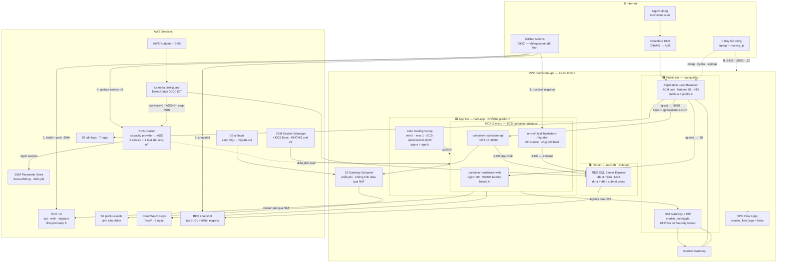
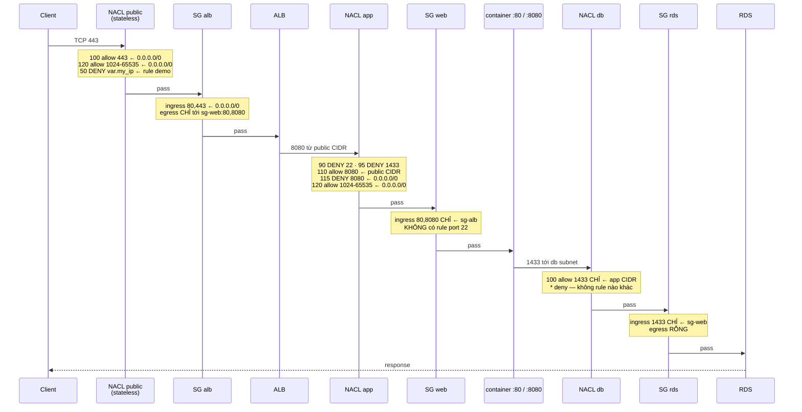
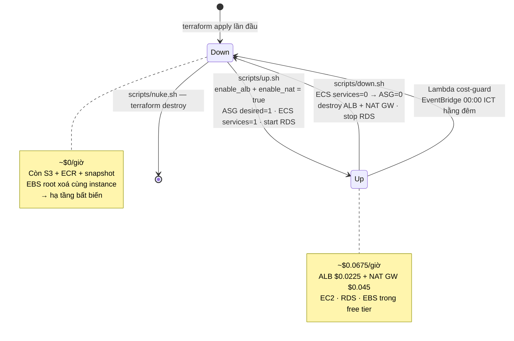
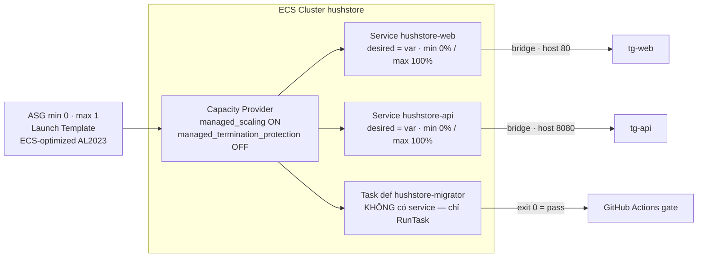
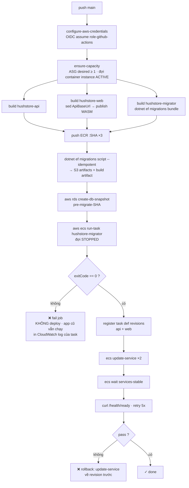

# AWS Terraform + ECS Infrastructure Design — HushStore (Đề tài 513)

**Date:** 2026-08-17
**Status:** Approved (sửa 2026-08-18 — xem "Đính chính")
**Supersedes:** [2026-05-13-ec2-deployment-design.md](2026-05-13-ec2-deployment-design.md)

---

## Đính chính 2026-08-18 — đổi AWS account

Spec này viết khi còn giả định triển khai trên account `408194747451`. Sau đó xác định lại: account đó **đã bị xoá sạch tài nguyên** sau báo cáo kỳ trước (không còn S3 bucket, EC2, RDS, snapshot, EIP, NAT, ALB, EBS hay ECR) và **đã hết free tier**, nên kỳ này dùng một AWS account khác.

Bốn điều chỉnh so với nội dung bên dưới:

1. **Danh tính là IAM Identity Center (SSO)**, permission set `AdministratorAccess`, session 8 giờ — không phải IAM user + access key. Không còn credential dài hạn nào trên máy, khớp với chủ đề "không còn static credential" của chính thiết kế này. Điểm least-privilege của đề bài nằm ở 4 role workload, không nằm ở role vận hành.
2. **Không có bước migrate/teardown nào.** Mọi mô tả về stack cũ, snapshot RDS cũ, giữ đường lùi đều không còn áp dụng. Đây là greenfield thật sự.
3. **Bỏ `import` block cho bucket ảnh sản phẩm.** Mục "Registry và S3" gọi đây là ngoại lệ duy nhất của stack greenfield; giờ không còn ngoại lệ nào — cả 3 bucket đều tạo mới, vì `hushstore-public-assets` không còn tồn tại và DB kỳ này seed từ đầu nên không có URL ảnh cũ nào để giữ.
4. **`hushstore-artifacts` và `hushstore-alb-logs` gắn hậu tố account ID.** Tên bucket S3 là duy nhất **toàn cầu**, không chỉ trong account, và hai tên đó quá phổ thông. Bucket ảnh giữ tên không hậu tố nếu còn trống, vì tên nó hiện trong URL ảnh công khai.

Account ID không xuất hiện cứng ở đâu ngoài `backend.tf` (block `backend "s3"` không nhận biến).

---

## Context

Đề tài 513 yêu cầu dùng **Terraform** dựng hạ tầng website thương mại điện tử trên AWS, với 5 thành phần bắt buộc: **VPC, Security Group, Network ACL, Application Load Balancer, EC2 Instance**, và phải chứng minh các rule mở theo **nguyên tắc tối thiểu** đồng thời **ngăn được tấn công** (verify bằng máy tấn công).

Repo hiện đã deploy được lên AWS nhưng bằng **bash + AWS CLI imperative** (`infra/setup.sh` — 310 dòng, 11 bước), và **thiếu 3/5 thành phần bắt buộc**:

| Đề bài yêu cầu | Hiện trạng |
|---|---|
| Terraform | ❌ bash + AWS CLI, state nằm trong `devops/resources.env` |
| VPC | ✅ `10.0.0.0/16`, 2 public + 2 private subnet |
| Security Group | ⚠️ có, nhưng SSH `22` + `80` + `443` mở trực tiếp trên EC2 public |
| **Network ACL** | ❌ **hoàn toàn chưa có** (đang dùng default NACL allow-all) |
| **Application Load Balancer** | ❌ **chưa có** — nginx nghe thẳng trên public IP của EC2 |
| EC2 Instance chạy website | ⚠️ có, nhưng dựng tay: `docker compose` + nginx cài trên host |
| **Máy tấn công verify rules** | ❌ **chưa có kịch bản test nào** |

Ngoài ra pipeline hiện tại (`.github/workflows/deploy.yml`) có 2 điểm yếu: deploy bằng **SSH key dài hạn** (`EC2_SSH_KEY`), và **migration DB chạy ngầm lúc app khởi động** (`src/API/Program.cs:220`) — không có ai gate, không biết fail, và race nếu có nhiều instance.

Kết quả mong muốn: stack Terraform greenfield, module hoá, đủ 5 thành phần đề bài, chạy trên **ECS EC2 launch type** (containerized nhưng vẫn là EC2 thật — đúng yêu cầu "triển khai website thông qua EC2 Instance", khác Fargate serverless), pipeline CI/CD hoàn chỉnh **build → ECR → migrate DB → deploy**, cơ chế **bật/tắt tiết kiệm chi phí**, và **báo cáo kiểm thử bảo mật** chứng minh rule chặn được tấn công.

### Các quyết định đã chốt

1. **Greenfield Terraform** — viết lại toàn bộ; `infra/*.sh` archive làm spec tham chiếu.
2. **ECS trên EC2 launch type**, dockerize cả API và Blazor client. Container instance nằm ở private subnet.
3. **NAT Gateway** (AWS managed) cho egress; NAT GW và ALB đều là destroy target.
4. **Cost control** = script bật/tắt (`up.sh` / `down.sh` / `nuke.sh`) + **Lambda + EventBridge Scheduler** tự tắt hằng đêm.
5. **VPC Flow Logs** điều khiển bằng `var.enable_flow_logs`, **default `false`**.
6. **Máy tấn công = laptop** (biến `var.my_ip`), không dựng EC2 attacker.
7. **RDS tạo rỗng**; schema do pipeline migration dựng, seed bằng SQL scripts sẵn có.
8. **CI/CD đầy đủ**: GitHub OIDC → build 3 image → push **ECR** → **snapshot RDS** → **migration bằng one-off ECS task** → `ecs update-service` → health check. Xoá `EC2_SSH_KEY` và GHCR token.
9. **Bỏ `MigrateAsync()` khỏi startup**, chuyển sang **EF Core migration bundle** chạy như một task riêng trong pipeline.
10. **Sửa 4 điểm trong app code** (health check DB, ForwardedHeaders, bỏ static IAM key, bỏ MigrateAsync).
11. **ACM cert trên ALB**, giữ DNS ở Cloudflare (miễn phí).

---

## Kiến trúc

### Sơ đồ tổng thể



### Đường đi của request và các lớp rule chặn



### Vòng đời tiết kiệm chi phí



---

## Chi tiết thiết kế

### Mạng — module `network`

VPC **`10.20.0.0/16`** (CIDR mới, tránh trùng `10.0.0.0/16` của stack cũ trong lúc chuyển đổi). **3 tier × 2 AZ = 6 subnet** — subnet miễn phí, và tách app/db thành 2 tier riêng chính là điều kiện để viết NACL thật chặt:

| Subnet | CIDR | AZ | Chứa |
|---|---|---|---|
| `public-a` / `public-b` | `10.20.0.0/24` / `10.20.1.0/24` | a / b | ALB, NAT Gateway |
| `app-a` / `app-b` | `10.20.10.0/24` / `10.20.11.0/24` | a / b | ECS container instance (không public IP) |
| `db-a` / `db-b` | `10.20.20.0/24` / `10.20.21.0/24` | a / b | RDS |

- **NAT Gateway** đặt ở `public-a` + EIP, route `0.0.0.0/0` của private RT trỏ vào. `count = var.enable_nat ? 1 : 0`. Chỉ 1 NAT GW cho cả 2 AZ — đúng, vì `max_size = 1` nên chỉ có một instance tại một thời điểm; NAT per-AZ chỉ cần khi thật sự multi-AZ HA.
- **S3 Gateway Endpoint** — miễn phí, gắn vào private route table. Traffic S3 không đi qua NAT nên **không bị tính $0.045/GB data processing**, và vẫn hoạt động khi NAT đã destroy.
- **VPC Flow Logs** — `var.enable_flow_logs`, **default `false`**. Khi bật: log `REJECT` vào CloudWatch, retention 1 ngày. Dùng khi cần bằng chứng tầng network cho kịch bản test 2/3/5; bình thường tắt để khỏi tốn phí ingest.

> Điểm đáng ghi vào báo cáo: **NAT Gateway không gắn được Security Group** (khác NAT instance) — nên toàn bộ việc kiểm soát egress phải làm ở `sg-web` egress rule và `nacl-app` outbound rule.

### Network ACL — deliverable trọng tâm của đề bài

NACL **stateless**, nên mỗi chiều phải khai báo cả traffic đi và traffic trả về — khác hoàn toàn SG stateful. Đây là phần kỹ thuật đáng viết nhất trong báo cáo. Số rule nhỏ hơn = ưu tiên cao hơn.

**`nacl-public`** (chứa ALB + NAT GW):

| # | Inbound | # | Outbound |
|---|---|---|---|
| 50 | **DENY all từ `var.my_ip`** — rule demo, `var.enable_deny_demo` | 100 | allow 80 → app CIDR |
| 100 | allow 80 ← `0.0.0.0/0` | 110 | allow 8080 → app CIDR |
| 110 | allow 443 ← `0.0.0.0/0` | 120 | allow 80, 443 → `0.0.0.0/0` *(egress qua NAT)* |
| 120 | allow 1024-65535 ← `0.0.0.0/0` *(return traffic của ALB và NAT)* | 130 | allow 1024-65535 → `0.0.0.0/0` *(response về client + về app)* |
| `*` | deny | `*` | deny |

**`nacl-app`** (chứa ECS container instance) — thứ tự rule ở đây là điểm kỹ thuật cốt lõi:

| # | Inbound | # | Outbound |
|---|---|---|---|
| 90 | **DENY 22 ← `0.0.0.0/0`** | 100 | allow 1433 → db CIDR |
| 95 | **DENY 1433 ← `0.0.0.0/0`** | 110 | allow 80, 443 → `0.0.0.0/0` *(ECR, SSM, yum)* |
| 100 | allow 80 ← public CIDR | 120 | allow 1024-65535 → public CIDR *(response về ALB)* |
| 110 | allow 8080 ← public CIDR | `*` | deny |
| 115 | **DENY 8080 ← `0.0.0.0/0`** | | |
| 120 | allow 1024-65535 ← `0.0.0.0/0` *(bắt buộc: return traffic từ internet qua NAT)* | | |
| `*` | deny | | |

> Rule 95 và 115 tồn tại **vì** rule 120. Return traffic qua NAT Gateway vào subnet với src `0.0.0.0/0` và dst port ephemeral, nên rule 120 là bắt buộc — mà `1433` và `8080` đều nằm trong dải `1024-65535`, tức rule 120 sẽ vô tình mở chúng ra internet ở tầng NACL. Đặt DENY ở số nhỏ hơn (95, 115) để chặn trước khi rule 120 được xét. Đây chính là minh hoạ cho việc **NACL xét rule theo thứ tự và không có state**, và là lý do vẫn cần SG làm lớp thứ hai.

**`nacl-db`** — chặt nhất, không có rule nào ngoài 1433:

| # | Inbound | # | Outbound |
|---|---|---|---|
| 100 | allow 1433 ← app CIDR | 100 | allow 1024-65535 → app CIDR |
| `*` | deny | `*` | deny |

Rule `50` DENY theo IP ở `nacl-public` là cách chứng minh **NACL làm được điều SG không làm được** — SG chỉ có allow-list, không thể chặn riêng một IP.

### Security Group — module `security`

Ba SG (không cần `sg-nat` vì NAT Gateway không nhận SG). Tất cả rule dùng **source/destination là SG khác**, không dùng CIDR, trừ chỗ buộc phải mở ra internet:

| SG | Ingress | Egress |
|---|---|---|
| `sg-alb` | 80, 443 ← `0.0.0.0/0` | 80 → `sg-web`, 8080 → `sg-web` *(không mở gì khác)* |
| `sg-web` | 80 ← `sg-alb`, 8080 ← `sg-alb` — **không có rule port 22 nào** | 1433 → `sg-rds`, 443 + 80 → `0.0.0.0/0` *(ECR pull, SSM, yum)* |
| `sg-rds` | 1433 ← `sg-web` **duy nhất** | **rỗng** — RDS không cần egress |

Task migrator chạy `bridge` trên cùng container instance nên dùng luôn `sg-web` → không cần SG thứ tư.

Admin access qua **SSM Session Manager** (vào host) và **ECS Exec** (vào trong container) → port 22 đóng hoàn toàn, không key pair, không file `.pem`.

> Chọn **bridge network mode + static host port** (`80`, `8080`) thay vì dynamic port mapping, để `sg-web` ingress giữ đúng 2 port thay vì phải mở dải `32768-65535` ← `sg-alb`. Đánh đổi được ghi ở mục Rủi ro.

### ALB — module `alb`

- Internet-facing, 2 subnet public. Listener `:80` → redirect 301 sang `:443`. Listener `:443` với **ACM cert** (DNS validation; `terraform output` in ra CNAME để thêm vào Cloudflare một lần).
- **2 target group**, type `instance`, đăng ký tự động bởi ECS service:
  - `tg-web` → `:80` (container nginx), health check `/`
  - `tg-api` → `:8080` (container .NET), health check **`/health/ready`**
  - Listener rule: `Host = api.hushstore.io.vn` → `tg-api`, default → `tg-web`
- **Access logs** → `hushstore-alb-logs` (lifecycle 7 ngày) — nguồn bằng chứng chính cho báo cáo kiểm thử khi flow logs đang tắt.
- `count = var.enable_alb ? 1 : 0`, `enable_deletion_protection = false`.

### ECS trên EC2 — module `ecs`



- **Launch Template** dùng **AMI ECS-optimized Amazon Linux 2023** (`ssm_parameter` public), `user_data` chỉ cần `echo ECS_CLUSTER=... >> /etc/ecs/ecs.config` + tạo **2GB swap** (t3.micro chỉ 1GB RAM). Mọi thứ khác đã nằm trong image.
- **ASG** `min 0 / max 1 / desired = var.instance_count`, trải `app-a` + `app-b`. `desired = 0` xoá luôn instance **và EBS root volume** → về $0 thật.
- **`managed_termination_protection = DISABLED`** — bắt buộc, nếu bật thì capacity provider không xoá được và `nuke.sh` sẽ treo.
- **3 task definition**, `requires_compatibilities = ["EC2"]`, `network_mode = "bridge"`:
  - `hushstore-web`: image `ECR/hushstore-web:<sha>`, hostPort 80, memory 128MB
  - `hushstore-api`: image `ECR/hushstore-api:<sha>`, hostPort 8080, memory hard 512 / reservation 384, `linuxParameters.maxSwap` + `swappiness` (chỉ EC2 launch type hỗ trợ)
  - `hushstore-migrator`: image `ECR/hushstore-migrator:<sha>`, **không port mapping, không service** — chỉ được gọi bằng `RunTask` từ pipeline, chạy xong thoát
  - Secrets inject bằng khối `secrets` → `valueFrom` ARN của SSM Parameter Store. **Không còn file `.env` trên disk.**
  - Log driver `awslogs` → `/ecs/hushstore-{api,web,migrator}`, retention 3 ngày.
- Không đặt container-level `healthCheck` (image `aspnet:10.0` không có `curl`); health check do ALB target group đảm nhiệm cùng `health_check_grace_period_seconds`.

### Migration DB — chuyển từ startup sang pipeline

Hiện `src/API/Program.cs:220` gọi `MigrateAsync()` khi app boot ở Production. Vấn đề: không ai gate được, migration fail thì app cứ crash-loop, và hai task API cùng lên sẽ race trên bảng `__EFMigrationsHistory`.

Chuyển sang **EF Core migration bundle** — cơ chế deploy chính thức của EF Core, đóng gói toàn bộ 20 migration thành một executable độc lập:

- **`src/Infrastructure/Dockerfile.migrator`** — stage `sdk:10.0` chạy `dotnet ef migrations bundle --project src/Infrastructure --startup-project src/API -o /app/efbundle`, stage runtime `runtime:10.0` chỉ chứa `efbundle`.
- Pipeline gọi `aws ecs run-task` với task def `hushstore-migrator`; connection string inject từ SSM Parameter Store. **Exit code 0 là điều kiện để bước deploy chạy tiếp** — migration fail thì không deploy, app cũ vẫn đang phục vụ.
- CI đồng thời sinh `dotnet ef migrations script --idempotent` → upload `migrate-<sha>.sql` lên `hushstore-artifacts` làm artifact review được, và attach vào build.
- Trước khi migrate, CI chạy `aws rds create-db-snapshot` — rollback DB có điểm quay về. **Chính sách forward-only**, không dùng down-migration.

Nhờ vậy `MigrateAsync()` bị xoá khỏi `Program.cs`, và `max_size = 1` giờ chỉ còn lý do cost + RAM + độ chính xác của rate limiter, không còn là ràng buộc correctness.

### Dockerize client — file mới

Client hiện là static bundle được `rsync` vào `/var/www` trên host. Chuyển thành image riêng, **WASM bundle bake sẵn trong image** → bỏ hẳn bước `s3 sync` và bind mount:

- **`src/Client/Dockerfile`** — multi-stage: `sdk:10.0` publish Client → copy `wwwroot/` vào `nginx:alpine`.
- **`src/Client/nginx.conf`** — chỉ còn `listen 80`, `root /usr/share/nginx/html`, SPA fallback `try_files $uri $uri/ /index.html`, cache header 1 năm cho `.wasm/.js/.css`. **Không SSL** (ALB terminate TLS), **không proxy block** (ALB route `api.*` trực tiếp sang `tg-api`).
- `nginx/hushstore.conf` và `deploy.sh` trở thành legacy → archive.

### Dữ liệu — module `data`

RDS `sqlserver-ex`, `db.t3.micro`, 20GB gp2, single-AZ (Express không hỗ trợ Multi-AZ), trong `db-a`/`db-b` subnet group, `publicly_accessible = false`, backup retention 7 ngày (miễn phí tới bằng dung lượng cấp phát).

Master password sinh bằng `random_password`, lưu vào **SSM Parameter Store SecureString** — **miễn phí**, thay vì Secrets Manager ($0.40/secret/tháng). Cùng chỗ đó lưu connection string đầy đủ và `JwtSettings__SecretKey`. Không còn cần GHCR token vì đã chuyển sang ECR.

DB tạo rỗng: schema do task migrator dựng ở lần chạy pipeline đầu tiên; seed dữ liệu bằng SSM Session Manager vào host → `docker run --rm mcr.microsoft.com/mssql-tools` chạy `seed_data.sql` + `seed_product_data.sql` tải từ `hushstore-artifacts`.

### Registry và S3 — module `storage`

| Resource | Vai trò | Ghi chú |
|---|---|---|
| **ECR** `hushstore-api`, `hushstore-web`, `hushstore-migrator` | Container images | `scan_on_push`, lifecycle keep last 5. Thay GHCR → ECS agent pull bằng execution role, **không cần registry credential** |
| S3 `hushstore-public-assets` | Ảnh sản phẩm | **Ngoại lệ duy nhất dùng `import` block** — đang có ảnh thật, không được tạo lại. Terraform chỉ quản policy/CORS/public-access |
| S3 `hushstore-artifacts` | `migrate-<sha>.sql`, seed SQL, file ops | Private, lifecycle 30 ngày |
| S3 `hushstore-alb-logs` | ALB access logs | Lifecycle 7 ngày |
| S3 `hushstore-tfstate` | Terraform state | Tạo bởi `bootstrap/`, versioning bật, native lockfile (`use_lockfile = true`, Terraform ≥ 1.10 — không cần DynamoDB) |

### IAM — 4 role, mỗi role một phạm vi

ECS tách quyền tốt hơn hẳn instance profile đơn lẻ — đây là điểm least-privilege mạnh nhất của thiết kế:

| Role | Gắn vào | Quyền |
|---|---|---|
| `role-container-instance` | EC2 instance profile | `AmazonEC2ContainerServiceforEC2Role` + `AmazonSSMManagedInstanceCore`. **Không có quyền S3 hay DB nào** |
| `role-task-execution` | ECS agent khi khởi task | Pull ECR, `logs:CreateLogStream/PutLogEvents`, `ssm:GetParameters` trên `/hushstore/prod/*`, `kms:Decrypt` |
| `role-task-app` | Container API lúc runtime | **Chỉ** `s3:PutObject/GetObject` trên prefix của assets bucket + `ssmmessages:*` cho ECS Exec. Đây là thứ thay thế static IAM key |
| `role-github-actions` | GitHub OIDC | Trust condition `sub = repo:elmira-athena/PBL3:ref:refs/heads/main`. Quyền: `ecr:*` trên 3 repo · `ecs:RegisterTaskDefinition` · `ecs:RunTask`/`DescribeTasks` giới hạn task def migrator · `ecs:UpdateService`/`DescribeServices` trên 2 service · `iam:PassRole` giới hạn 3 task role · `rds:CreateDBSnapshot`/`DescribeDBSnapshots` · `autoscaling:SetDesiredCapacity`/`DescribeAutoScalingGroups` · `s3:PutObject` trên artifacts |

AWS SDK trong container tự lấy credential của `role-task-app` qua `AWS_CONTAINER_CREDENTIALS_RELATIVE_URI` — nên chỉ cần bỏ `BasicAWSCredentials` là xong, không phải viết thêm code.

### CI/CD — 2 workflow

**`.github/workflows/deploy.yml`** — viết lại hoàn toàn. Xoá `EC2_SSH_KEY` / `EC2_HOST`, không còn `rsync`, không còn SSH. Tag image bằng **git SHA** (immutable) thay vì `latest` → rollback bằng cách trỏ lại task definition revision cũ.



Điểm quan trọng của thứ tự này: **migration là gate**. Ba image build song song (`paths-filter` giữ nguyên để bỏ qua build không cần thiết), nhưng migrator phải chạy xong và exit 0 trước khi service nào được cập nhật. Migration fail → job dừng, app cũ vẫn phục vụ bình thường, log của task in ra ngay trong output của Actions.

Bước `ensure-capacity` cần thiết vì task migrator là `bridge` trên EC2 launch type — phải có container instance đang chạy. Nếu `down.sh` vừa hạ ASG về 0 thì pipeline tự bật lên 1.

**`.github/workflows/infra.yml`** — mới. Trên PR có thay đổi `infra/tf/**`: `terraform fmt -check` → `validate` → `plan` với một **role OIDC read-only riêng** (`ReadOnlyAccess` + `s3:GetObject` state bucket), rồi comment kết quả plan vào PR. Không `apply` tự động — apply vẫn chạy tay để giữ kiểm soát trên hạ tầng tốn phí.

> **Superseded by Phase 2 plan §2** (`docs/superpowers/plans/2026-08-22-aws-terraform-phase2-cicd.md`). File tên `ci.yml`, và nó **không chạy `plan`**: `plan` phải đọc tfstate, mà tfstate chứa master password của RDS ở dạng plaintext (`random_password` luôn nằm trong state). Vì thế role plan bị **Deny tường minh `s3:GetObject`** thay vì được cấp — ngược hẳn với dòng trên. Thay cho `plan`, CI chạy `terraform test`.

### Sửa app code — 4 điểm

> Số dòng dưới đây tính theo commit `ae1180f` và sẽ dịch sau khi áp dụng từng thay đổi — dùng tên symbol để định vị thay vì tin vào số dòng.

| File | Thay đổi | Lý do |
|---|---|---|
| `src/API/Program.cs:308` | Thêm `AddHealthChecks().AddDbContextCheck<HushStoreDbContext>()`, expose `/health/live` + `/health/ready`; giữ `/health` cũ cho tương thích | `/health` hiện không chạm DB → ALB báo healthy dù RDS chết |
| `src/API/Program.cs:261` | Thêm `UseForwardedHeaders` (`XForwardedFor \| XForwardedProto`, `KnownNetworks` = VPC CIDR) **trước** `UseHttpsRedirection`; tắt `UseHttpsRedirection` ở Production | ALB terminate TLS rồi forward HTTP → hiện không đọc `X-Forwarded-Proto`, có nguy cơ redirect loop |
| `src/API/Program.cs:191-197` | Bỏ `BasicAWSCredentials`, đổi thành `new AmazonS3Client(region)` → default credential chain lấy credential của ECS task role. Xoá `AccessKeyId`/`SecretAccessKey` khỏi `appsettings.json` và `.env.example` | Sau thay đổi này **trong toàn hệ thống không còn credential dài hạn nào** — CI đã OIDC, SSH đã bỏ, registry đã dùng IAM |
| `src/API/Program.cs:218-225` | **Xoá khối `MigrateAsync()`**; migration do task migrator trong pipeline lo | Startup migration không gate được, fail thì crash-loop, và race giữa nhiều task |

Khối seed role `Technician` (`src/API/Program.cs:228`) giữ nguyên — idempotent, chạy sau khi schema đã có sẵn.

`src/Client/wwwroot/appsettings.json` giữ `ApiBaseUrl = https://api.hushstore.io.vn`; CI `sed` trước khi publish để tham số hoá theo môi trường (hiện đang bake cứng lúc build).

### Cost guard — module `costguard`

- **Biến toggle**: `enable_alb`, `enable_nat`, `instance_count`, `service_desired_count`, `enable_flow_logs`, `enable_deny_demo`.
- `scripts/up.sh` — apply toggle bật, `aws rds start-db-instance`, đợi ECS service stable. `scripts/down.sh` — ECS service về 0 → ASG về 0 → destroy ALB + NAT GW → stop RDS (**thứ tự quan trọng**, ngược lại ECS sẽ liên tục thử replace task). `scripts/nuke.sh` — `terraform destroy` toàn bộ. Dùng **toggle + apply** thay vì `destroy -target` để state không lệch.
- **Lambda `hushstore-cost-guard`** (Python 3.13, arm64) + **EventBridge Scheduler** cron 00:00 ICT: `UpdateService(desiredCount=0)` × 2 → `SetDesiredCapacity(0)` → `StopDBInstance`. Lambda **chỉ gọi API scale/stop**, không xoá ALB/NAT — xoá resource ngoài Terraform sẽ làm state drift và hỏng lần apply sau. Nếu phát hiện ALB/NAT còn tồn tại, Lambda gửi SNS nhắc chạy `down.sh`.
- **AWS Budgets** $10 / $20 / $40 → SNS email (giữ hành vi của `setup.sh` bước 10, nâng ngưỡng vì NAT GW đắt hơn NAT instance).

---

## Cấu trúc file

```
infra/
├── legacy-cli/                     # MOVE: setup.sh teardown.sh start.sh stop.sh config.example.json
│                                   #       nginx/hushstore.conf deploy.sh
└── tf/
    ├── bootstrap/                  # state bucket — backend local, chạy 1 lần
    ├── envs/prod/                  # backend.tf main.tf variables.tf outputs.tf terraform.tfvars
    ├── modules/
    │   ├── network/                # VPC subnet RT IGW NAT-GW NACL×3 S3-endpoint flow-logs(optional)
    │   ├── security/               # 3 security group
    │   ├── data/                   # RDS + subnet group + SSM parameters
    │   ├── ecs/                    # cluster capacity-provider ASG launch-template task-def×3 service×2 IAM×3
    │   ├── alb/                    # ALB + 2 target group + listener + rule + ACM + log bucket
    │   ├── storage/                # ECR×3 + S3×3 + import block cho assets
    │   ├── cicd/                   # GitHub OIDC provider + role deploy + role plan-readonly
    │   └── costguard/              # Lambda + EventBridge Scheduler + Budgets + SNS
    └── scripts/                    # up.sh down.sh nuke.sh
src/Client/Dockerfile               # NEW: sdk publish WASM → nginx:alpine
src/Client/nginx.conf               # NEW: listen 80, SPA fallback, cache header
src/Infrastructure/Dockerfile.migrator  # NEW: dotnet ef migrations bundle → runtime:10.0
.github/workflows/deploy.yml        # REWRITE: OIDC → ECR ×3 → snapshot → migrate gate → ECS → rollback
.github/workflows/ci.yml            # NEW: fmt + validate + terraform test. KHÔNG plan
                                    #      (superseded by Phase 2 plan §2 — role plan bị
                                    #       Deny s3:GetObject nên không đọc được tfstate)
docs/
├── terraform-runbook.md            # cách chạy, chi phí, bật/tắt, seed DB, rollback
└── security-validation-report.md   # kết quả tấn công — "Đầu ra" của đề bài
src/API/Program.cs                  # EDIT: 4 thay đổi ở trên
src/API/appsettings.json            # EDIT: xoá AccessKeyId/SecretAccessKey
```

---

## Phân rã thành 3 implementation plan

Phạm vi này quá lớn cho một plan duy nhất. Chia theo ranh giới dependency, mỗi phase kết thúc ở một trạng thái verify được:

**Phase 1 — Hạ tầng nền + ứng dụng chạy được** (spec này, plan riêng)
Bước 0-9: teardown stack cũ, bootstrap state, `network` / `security` / `storage` / `data`, dockerize client + migrator, sửa 4 điểm `Program.cs`, `ecs`, `alb`, seed DB.
*Điều kiện hoàn thành:* `https://hushstore.io.vn` phục vụ được, login lấy JWT, upload ảnh trả URL S3 hợp lệ.

**Phase 2 — CI/CD** (plan riêng)
Bước 10: `cicd` module, viết lại `deploy.yml` với migration gate, viết `infra.yml`, xoá secret cũ.
*Điều kiện hoàn thành:* push `main` → deploy tự động; migration lỗi làm fail job mà không update service.

**Phase 3 — Cost guard + kiểm thử bảo mật** (plan riêng)
Bước 11-12: `costguard` module, `up.sh`/`down.sh`/`nuke.sh`, 11 kịch bản tấn công, `security-validation-report.md`.
*Điều kiện hoàn thành:* `down.sh` đưa chi phí về ~$0 và `up.sh` dựng lại đủ; báo cáo có bằng chứng cho cả 11 kịch bản.

Thứ tự bắt buộc: Phase 1 → Phase 2 → Phase 3. Phase 3 cần ALB tồn tại để tấn công; Phase 2 cần cluster và service đã chạy.

---

## Verification

### Kiểm tra hạ tầng

```bash
cd infra/tf/envs/prod
terraform fmt -check -recursive && terraform validate
terraform plan          # lần 2 sau apply phải ra "No changes" → không drift
terraform output        # alb_dns_name, acm_validation_record, rds_endpoint, ecr_urls
aws ecs describe-services --cluster hushstore --services hushstore-web hushstore-api \
  --query 'services[].{name:serviceName,running:runningCount,desired:desiredCount}'
```

- `up.sh` → `https://hushstore.io.vn` load được, login lấy được JWT, upload ảnh sản phẩm trả URL S3 hợp lệ (**chứng minh ECS task role hoạt động, không còn static key nào**).
- `down.sh` → `terraform plan` không lỗi; `describe-load-balancers` và `describe-nat-gateways` rỗng; ECS service `desiredCount=0`; ASG `desired=0`; RDS `stopped`.
- `up.sh` lại → instance **và container mới hoàn toàn** vẫn tự lên đủ, không cần thao tác tay → chứng minh hạ tầng bất biến.

### Kiểm tra pipeline

- **Happy path**: push commit nhỏ vào `main` → Actions xanh; `describe-task-definition` cho thấy revision mới trỏ image tag `:<sha>`; `migrate-<sha>.sql` xuất hiện trong S3 artifacts; snapshot `pre-migrate-<sha>` tồn tại.
- **Migration gate**: cố tình push một migration lỗi (ví dụ thêm `NOT NULL` không default vào bảng đã có dữ liệu) → job **fail ở bước `run-task`**, in log CloudWatch của task, **service không được update**, website cũ vẫn chạy bình thường. Đây là bài test quan trọng nhất của pipeline.
- **Rollback**: `ecs update-service --task-definition hushstore-api:<revision-1>` → verify về đúng version cũ, health check pass.
- **Không còn secret dài hạn**: `gh secret list` chỉ còn `AWS_ROLE_ARN` (không phải credential), không còn `EC2_SSH_KEY` / `EC2_HOST` / GHCR token.
- **`infra.yml`**: mở PR sửa một dòng trong `modules/network` → bot comment plan vào PR, không apply.

> **Superseded by Phase 2 plan §2.** Hai dòng trên đã bị thay: không có một `AWS_ROLE_ARN` duy nhất mà **hai repository variable** (`AWS_DEPLOY_ROLE_ARN`, `AWS_PLAN_ROLE_ARN`) cho hai role tách biệt — và chúng là *variable* chứ không phải *secret*, vì ARN của role không phải bí mật (xem kịch bản 11 trong `docs/security-validation-report.md`). Và `ci.yml` không comment plan vào PR: nó chạy `terraform test`.

### Kiểm thử bảo mật — từ laptop (`var.my_ip`)

| # | Kịch bản | Kết quả mong đợi | Rule chịu trách nhiệm |
|---|---|---|---|
| 1 | `nmap -Pn -p- <alb-dns>` | Chỉ `80`, `443` open | `sg-alb` ingress |
| 2 | `nmap -Pn -p- <ec2-private-ip>` | Không route được | Không public IP + app subnet không có route ra IGW |
| 3 | `sqlcmd -S <rds-endpoint>,1433` | Timeout | `publicly_accessible=false` + `sg-rds` + `nacl-db` |
| 4 | `curl http://<alb-dns>:8080` | Connection refused | ALB chỉ có listener 80/443 |
| 5 | `ssh <alb-dns>` và mọi IP trong VPC | Refused ở mọi hướng | Không có SG rule 22 + `nacl-app` rule 90 DENY |
| 6 | `hydra` / 20 request `POST /api/auth/login` | HTTP 429 từ request thứ 6 | Rate limiter `LoginRateLimit` |
| 7 | `curl -H "Host: evil.com" https://<alb-dns>` | Không lọt sang `tg-api` | ALB listener rule theo host |
| 8 | Bật `enable_deny_demo=true` → `curl https://hushstore.io.vn` | Timeout **chỉ với laptop**, máy khác vẫn vào được | `nacl-public` rule 50 DENY — **chứng minh NACL làm được điều SG không làm được** |
| 9 | Bật `enable_flow_logs=true`, chạy lại 2/3/5, đọc `REJECT` trong CloudWatch + ALB access logs | Có log khớp từng kịch bản | Bằng chứng cho phần "Đầu ra" |
| 10 | ECS Exec vào container API → `curl 169.254.170.2$AWS_CONTAINER_CREDENTIALS_RELATIVE_URI`, thử `aws rds describe-db-instances` | Trả credential của task role; lệnh RDS bị `AccessDenied` | `role-task-app` chỉ có quyền S3 — chứng minh blast radius nhỏ |
| 11 | Lấy `AWS_ROLE_ARN` rồi thử `assume-role-with-web-identity` từ máy ngoài | `AccessDenied` — trust policy chỉ nhận OIDC token của repo/branch cụ thể | `role-github-actions` trust condition |

Mỗi kịch bản chụp output lệnh + log tương ứng vào `docs/security-validation-report.md`.

---

## Chi phí dự kiến

| Thành phần | 24/7 | Với `down.sh` ~3h/ngày |
|---|---|---|
| **NAT Gateway** ($0.045/h + $0.045/GB) | $32.90/mo | ~$4.10/mo |
| **ALB** ($0.0225/h) | $16.40/mo | ~$2.05/mo |
| EC2 `t3.micro` + EBS 30GB | free tier 750h | free tier |
| RDS `db.t3.micro` sqlserver-ex + 20GB + snapshot | free tier 750h | free tier |
| ECR (3 image × 5 revision ≈ 3.5GB) | ~$0.35/mo | ~$0.35/mo |
| S3 ×3 + CloudWatch Logs + Lambda + EventBridge + ACM + SSM + Parameter Store + S3 Endpoint + Budgets | ~$0.50/mo | ~$0.30/mo |
| **Tổng (còn free tier)** | **~$50/mo** | **~$6.8/mo** |
| **Tổng (hết free tier)** | ~$75/mo | ~$12/mo |

NAT Gateway là khoản đắt nhất và không có bậc free tier — nên `down.sh` / Lambda cost-guard là bắt buộc, không phải tuỳ chọn.

---

## Rủi ro và đánh đổi đã cân nhắc

- **Pipeline cần container instance đang chạy** để `run-task` migrator (bridge mode, EC2 launch type). Đã xử bằng bước `ensure-capacity` tự bật ASG lên 1. Nếu muốn migration độc lập hoàn toàn với ASG thì phải thêm Fargate capacity provider + `awsvpc` + SG thứ tư cho task migrator — cân nhắc rồi bỏ, vì thêm một launch type chỉ để chạy 30 giây không xứng độ phức tạp.
- **Migration là forward-only.** Không dùng EF down-migration; rollback DB dựa vào snapshot `pre-migrate-<sha>`. Migration phải viết theo hướng tương thích ngược (thêm column nullable trước, backfill, mới siết constraint ở lần sau) để app version cũ không chết trong lúc rolling deploy.
- **`t3.micro` 1GB RAM chạy ECS agent + nginx + .NET là chật** (~400-450MB thực dùng), và task migrator chạy chồng lên nữa. Đã bù bằng 2GB swap + `memoryReservation` thay hard limit. `var.instance_type` để dễ nâng lên `t3.small` (2GB, **không** free tier) nếu OOM.
- **Deploy có downtime ngắn (~20-40s)**. Static host port + 1 instance nên không chạy 2 bản song song → `deployment_minimum_healthy_percent = 0`, `maximum_percent = 100`. Đường zero-downtime là dynamic port mapping + 2 instance, nhưng phải mở `sg-web` ingress dải `32768-65535` ← `sg-alb` và tốn thêm instance — đánh đổi không xứng ở quy mô này. Ghi vào báo cáo như một lựa chọn có ý thức.
- **`max_size = 1`** giữ lại vì cost + RAM + rate limiter in-memory (5 req/min sẽ thành 10 nếu có 2 task). Sau khi bỏ `MigrateAsync()` thì đây không còn là ràng buộc correctness; scale thật chỉ cần chuyển rate limiter sang ElastiCache.
- **SSM và ECR cần NAT** — khi `enable_nat=false`, Session Manager mất kết nối và ECS không pull được image, pipeline sẽ fail ở `run-task`. Thay bằng VPC interface endpoint cho `ssm`/`ssmmessages`/`ec2messages`/`ecr.api`/`ecr.dkr`/`logs` tốn ~$50/mo, đắt hơn cả NAT GW 24/7 → không dùng. `up.sh` phải chạy trước khi push code.
- **NAT Gateway không gắn được Security Group** — kiểm soát egress dồn hết vào `sg-web` egress và `nacl-app` outbound. Lọc egress theo domain cần AWS Network Firewall (~$300/mo) — không khả thi, ghi nhận như giới hạn.
- **`nacl-app` rule 120 buộc phải mở dải ephemeral** cho return traffic qua NAT — đã bù bằng DENY 1433 và DENY 8080 ở rule số nhỏ hơn, nhưng đây là giới hạn bản chất của NACL stateless và là lý do SG vẫn cần thiết.
- **RDS stopped vẫn tính phí storage** — 20GB nằm trong free tier; hết free tier ~$2.3/mo. AWS tự start lại RDS sau 7 ngày stop, Lambda cost-guard sẽ stop lại ở lần chạy kế tiếp.
- **ACM validation CNAME phải thêm tay vào Cloudflare một lần** — đã cân nhắc Cloudflare provider để tự động, nhưng phải quản thêm API token; `terraform output` in sẵn record là đủ.
- **`import` bucket ảnh sản phẩm** là ngoại lệ duy nhất trong stack greenfield. Nếu bỏ qua, toàn bộ URL ảnh sản phẩm hiện có sẽ chết.
- **`infra.yml` chỉ `plan`, không `apply`** — cố ý. Hạ tầng có NAT GW và ALB tốn phí theo giờ, không nên để một merge vô tình dựng lên. *(**Superseded by Phase 2 plan §2**: `ci.yml` không chạy cả `plan`. Ràng buộc "không tự dựng hạ tầng tốn phí" giữ nguyên nhưng được canh ở tầng IAM — role deploy không có `autoscaling:SetDesiredCapacity` và không có `rds:StartDBInstance`, có `terraform test` assert điều đó.)*
